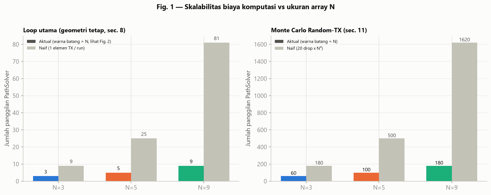
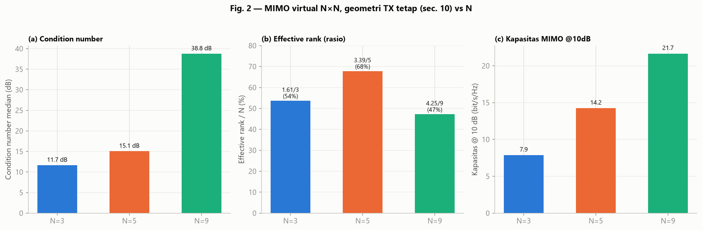
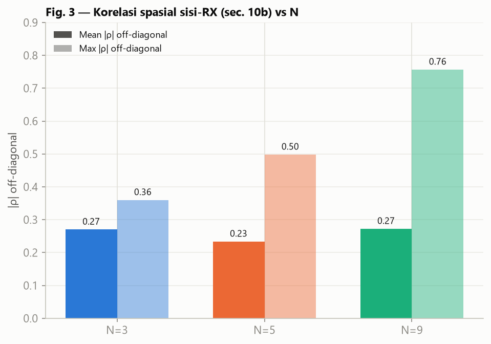
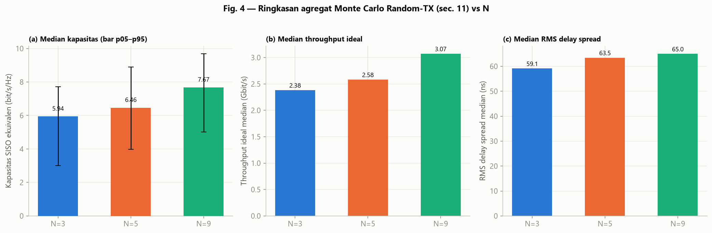
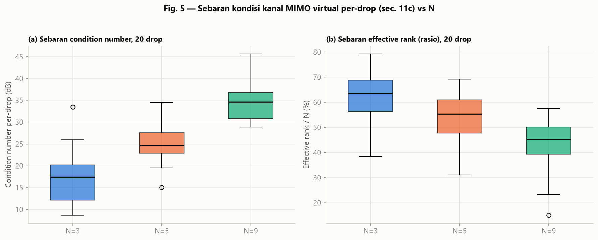

# Analisis Skalabilitas Metode Monte Carlo (v3, konsisten): N = 3×3, 5×5, 9×9

## Ringkasan teknis

Dokumen ini membandingkan metode Monte Carlo *Random-TX* (section 11 pada notebook) untuk tiga ukuran array TX/skenario-RX-lensa: **N = 3, 5, dan 9**, dari tiga notebook **"v3"** yang konsisten:

1. **N = 3** — [`Setupv3_20mx20m_lens_3x3_Patch_randomCom.ipynb`](Setupv3_20mx20m_lens_3x3_Patch_randomCom.ipynb)
2. **N = 5** — [`Setupv3_20mx20m_lens_5x5_Patch_randomCom.ipynb`](Setupv3_20mx20m_lens_5x5_Patch_randomCom.ipynb)
3. **N = 9** — [`Setupv3_20mx20m_lens_9x9_Patch_randomCom.ipynb`](Setupv3_20mx20m_lens_9x9_Patch_randomCom.ipynb)

Ketiga notebook memakai ruang 20 m × 20 m × 3 m, 38 GHz, 20 *drop* Monte Carlo, 100.000 sampel lintasan per sumber, daya 10 dBm per TX, dan *random seed* yang sama (20260718). Yang berbeda **hanya** jumlah elemen TX / skenario sudut lensa RX (N). Angka pada dokumen ini **tidak dihitung ulang** — seluruh nilai diambil dari output sel yang sudah tersimpan di ketiga notebook (lihat `Analisis_Skalabilitas_MonteCarlo_v3_3x3_5x5_9x9/data/raw_logs/`).

> **Catatan versi.** Dokumen ini adalah **versi perbaikan** dari analisis sebelumnya ([`ANALISIS_SKALABILITAS_MONTE_CARLO_3x3_5x5_9x9.md`](ANALISIS_SKALABILITAS_MONTE_CARLO_3x3_5x5_9x9.md)), yang memakai notebook **"v2"** untuk titik N=5 (`Setupv2_20mx20m_lens_5x5_Patch_randomCom.ipynb`). Notebook v2 tersebut ternyata mengandung bug konversi radian ganda pada `rx_orientation_deg` (nilai dari `rotate_antenna(...)`, yang sudah dalam radian, dikonversi sekali lagi lewat `np.deg2rad()`), sehingga metrik berbasis daya/gain absolut untuk N=5 pada analisis lama under-estimate dan tidak monoton terhadap N. Notebook **v3** yang dipakai di sini memakai literal derajat langsung (sama seperti N=3 dan N=9) dan **tidak mengandung bug tersebut**. Hasilnya, seperti akan terlihat di bawah, jauh lebih bersih dan konsisten.

**Temuan utama:**

- **Biaya komputasi bertumbuh linear terhadap N** (bukan kuadratik) berkat desain "TX simultan, satu pola bersama" — 3, 5, 9 *run* PathSolver per skenario geometri tetap (dibanding skema naif 9, 25, 81 bila tiap elemen TX disimulasikan satu per satu).
- **Kapasitas naik monoton di hampir semua metrik seiring N** — kapasitas MIMO virtual @10dB (7,9 → 14,2 → 21,7 bit/s/Hz), median kapasitas Monte Carlo agregat (5,94 → 6,46 → 7,67 bit/s/Hz), median *throughput* ideal (2,38 → 2,58 → 3,07 Gbit/s), dan median RMS *delay spread* (59,1 → 63,5 → 65,0 ns).
- **Condition number MIMO virtual memburuk monoton seiring N**, baik pada geometri tetap (11,7 → 15,1 → 38,8 dB) maupun pada rata-rata 20 *drop* Monte Carlo (17,5 → 24,6 → 34,6 dB).
- **Rasio effective-rank terhadap N cenderung menurun untuk N besar** — pola *diminishing-returns* yang jelas dan monoton pada data Monte Carlo per-*drop* (64% → 55% → 45%), meski pada satu titik geometri tetap tunggal (bukan rata-rata banyak *drop*) N=5 sempat menunjukkan rasio tertinggi (68%) — dibahas di bagian 2.
- Karena ketiga notebook sekarang benar-benar konsisten (sama-sama "v3"), **tidak ditemukan anomali/bug** seperti pada analisis sebelumnya — seluruh tren dapat dibaca apa adanya.

## Sumber data dan aset

Seluruh tabel CSV, figure PNG, log mentah, dan script pembuatnya disimpan di folder khusus:
[`Analisis_Skalabilitas_MonteCarlo_v3_3x3_5x5_9x9/`](Analisis_Skalabilitas_MonteCarlo_v3_3x3_5x5_9x9/) (lihat `README.md` di dalamnya untuk peta isi folder).

## Ruang lingkup dan parameter simulasi

| Parameter | N=3 | N=5 | N=9 |
|---|---:|---:|---:|
| Dimensi ruang | 20×20×3 m | 20×20×3 m | 20×20×3 m |
| Frekuensi / bandwidth | 38 GHz / 400 MHz | sama | sama |
| Titik frekuensi (N_F) | 401 | 401 | 401 |
| Elemen TX (fixed geometry) | 3 | 5 | 9 |
| Aperture array TX (Y) | ±0,45 m | ±0,90 m | ±1,80 m |
| Skenario sudut lensa RX | 3 (−45°, 0°, +45°) | 5 (−60°…+60°, step 30°) | 9 (−60°…+60°, step 15°) |
| *Drop* Monte Carlo | 20 | 20 | 20 |
| Sampel lintasan/sumber (Monte Carlo) | 100.000 | 100.000 | 100.000 |
| Daya per TX | 10 dBm | 10 dBm | 10 dBm |
| *Noise figure* / suhu derau | 7 dB / 290 K | sama | sama |
| *Random seed* | 20260718 | 20260718 | 20260718 |
| Total *run* PathSolver, geometri tetap (sec. 8) | 3 | 5 | 9 |
| Total *run* PathSolver, Monte Carlo (sec. 11) | 60 (20×3) | 100 (20×5) | 180 (20×9) |

Seluruh parameter identik kecuali N dan set sudut lensa yang diuji (lihat [Keterbatasan](#keterbatasan-dan-ketidakpastian) poin 3) — kondisi yang baik untuk perbandingan skalabilitas murni.

## 1. Skalabilitas biaya komputasi

| | N=3 | N=5 | N=9 | Rasio 9/3 |
|---|---:|---:|---:|---:|
| *Run* aktual (geometri tetap, TX simultan) | 3 | 5 | 9 | 3× |
| *Run* naif (1 elemen TX / run) | 9 | 25 | 81 | 9× |
| *Run* aktual Monte Carlo (20 drop × N) | 60 | 100 | 180 | 3× |
| *Run* naif Monte Carlo (20 drop × N²) | 180 | 500 | 1620 | 9× |

Karena semua elemen TX memakai pola yang sama dan diradiasikan sekaligus dalam satu *scene* Sionna, jumlah pemanggilan `PathSolver` bertumbuh **linear terhadap N**, bukan kuadratik. Dari N=3 ke N=9 (3× lipat jumlah elemen), biaya komputasi aktual naik 3× (9 *run* vs 180 *run* Monte Carlo), sedangkan skema naif (1 elemen TX disimulasikan sendiri-sendiri) akan naik 9× (81 *run* vs 1620 *run*). Trik "TX simultan, satu pola bersama" ini adalah keputusan desain yang membuat notebook N=9 tetap layak dijalankan (180 *run* × 100.000 sampel lintasan) dibanding kalau harus 1620 *run* pada skema naif.

Perlu dicatat: linearitas ini adalah linearitas **jumlah panggilan solver**, bukan linearitas **biaya per panggilan** — biaya *ray-tracing* per panggilan itu sendiri juga cenderung naik bersama N (lebih banyak sumber simultan berarti lebih banyak jejak sinar yang perlu dilacak untuk `samples_per_src` yang sama), sehingga *speedup* riil terhadap skema naif kemungkinan lebih besar dari rasio "jumlah *run*" saja, tetapi besarnya tidak diukur di sini (tidak ada log waktu eksekusi tersimpan di ketiga notebook).

## 2. MIMO virtual N×N pada geometri TX tetap (section 10)

| Metrik | N=3 | N=5 | N=9 |
|---|---:|---:|---:|
| Condition number median | 3,8 (11,7 dB) | 5,7 (15,1 dB) | 86,7 (38,8 dB) |
| Effective rank median | 1,61 / 3 (54%) | 3,39 / 5 (68%) | 4,25 / 9 (47%) |
| Kapasitas @10dB | 7,87 bit/s/Hz | 14,24 bit/s/Hz | 21,66 bit/s/Hz |

Matriks "N×N MIMO" di sini adalah kombinasi sintetis dari N pengukuran RX-lensa berbeda (bukan N RX aktif bersamaan — lihat catatan fisik di notebook asli), dievaluasi memakai SVD kanal gabungan.

*Condition number* median naik monoton seiring N: 11,7 dB (N=3) → 15,1 dB (N=5) → 38,8 dB (N=9). **Kapasitas @10dB juga naik monoton** dan sekarang jauh lebih "genap" jaraknya (7,87 → 14,24 → 21,66 bit/s/Hz) dibanding analisis lama yang memakai data N=5 bermasalah.

Satu hal menarik: **rasio effective-rank di titik N=5 ini justru tertinggi (68%)**, bukan berada rapi di antara N=3 (54%) dan N=9 (47%). Ini **bukan** tanda bug (tidak ada indikasi orientasi salah di sini — lihat verifikasi konfigurasi di README), melainkan **karakteristik satu titik geometri tunggal**: section 10 menggabungkan hanya 1 realisasi tetap per N, sehingga sensitif terhadap kecocokan spesifik antara ke-5 sudut lensa dan posisi RX pada geometri itu. Section 3 (Monte Carlo rata-rata 20 *drop*, bukan 1 titik) menunjukkan pola yang lebih halus dan monoton menurun (64% → 55% → 45%) — mengonfirmasi bahwa "68% pada N=5" adalah varians dari satu sampel geometri, bukan tren skalabilitas yang mendasarinya. Ini adalah pengingat bahwa metrik dari **satu** geometri tetap (section 10) punya varians sampel yang tidak kecil, dan kesimpulan skalabilitas yang lebih andal sebaiknya bersandar pada rata-rata banyak *drop* (section 11c, lihat bagian 5).

## 3. Korelasi spasial sisi-RX (section 10b)

| Metrik | N=3 | N=5 | N=9 |
|---|---:|---:|---:|
| Mean \|ρ\| off-diagonal | 0,270 | 0,233 | 0,272 |
| Max \|ρ\| off-diagonal | 0,360 | 0,498 | 0,757 |

*Mean* korelasi ketiga N kini berada pada rentang yang wajar dan berdekatan (0,23–0,27) — tidak ada lagi anomali seperti pada N=5 versi lama (0,53). *Max* korelasi naik cukup wajar dari N=3 ke N=9 (0,36 → 0,50 → 0,76): semakin banyak skenario sudut lensa yang dibandingkan, semakin besar peluang menemukan sepasang yang kebetulan sangat mirip satu sama lain (fenomena "makin banyak pasangan, makin mungkin ada pasangan mirip" — mirip *birthday paradox*), bukan berarti rata-ratanya ikut naik.

## 4. Ringkasan agregat Monte Carlo Random-TX (section 11)

| Metrik | N=3 | N=5 | N=9 |
|---|---:|---:|---:|
| Median kapasitas | 5,94 bit/s/Hz | 6,46 bit/s/Hz | 7,67 bit/s/Hz |
| Persentil 5–95 kapasitas | 3,00–7,72 | 3,97–8,90 | 5,02–9,68 |
| Median *throughput* ideal | 2,38 Gbit/s | 2,58 Gbit/s | 3,07 Gbit/s |
| Median RMS *delay spread* | 59,13 ns | 63,46 ns | 65,00 ns |
| *Outage* kapasitas < 1 bit/s/Hz | 0,0% | 0,0% | 0,0% |

Sekarang polanya **monoton naik dengan rapi** seiring N pada seluruh metrik agregat, sesuai ekspektasi fisik: lebih banyak TX yang menjumlahkan daya secara non-koheren ke satu RX → SNR terima makin tinggi → kapasitas SISO-ekuivalen dan *throughput* ideal makin tinggi. Kenaikan median kapasitas dari N=3 ke N=9 adalah +29% (5,94 → 7,67 bit/s/Hz), dengan N=5 (6,46) berada tepat di antara keduanya secara proporsional — konfirmasi kuat bahwa data N=5 di sini sudah bersih dari bug yang sebelumnya membuatnya berada *di bawah* N=3.

Median RMS *delay spread* juga naik monoton (59,1 → 63,5 → 65,0 ns), sejalan dengan aperture array TX yang makin lebar (±0,45 m → ±0,90 m → ±1,80 m) sehingga variasi jarak lintasan antar elemen TX ke RX (dan ke penghalang) makin beragam, memperlebar sebaran waktu tunda.

## 5. Sebaran kondisi kanal MIMO virtual per-drop (section 11c)

| Metrik (median atas 20 drop) | N=3 | N=5 | N=9 |
|---|---:|---:|---:|
| Condition number | 7,5 (17,5 dB) | 17,1 (24,6 dB) | 54,0 (34,6 dB) |
| Effective rank | 1,91/3 (64%) | 2,77/5 (55%) | 4,07/9 (45%) |
| Kapasitas @10dB | 8,03 bit/s/Hz | 12,81 bit/s/Hz | 21,11 bit/s/Hz |

Ini adalah figure paling meyakinkan pada dokumen ini: dibangun dari 20 baris data mentah per-N (bukan hanya titik ringkasan tunggal), sehingga rata-rata dan sebarannya jauh lebih stabil terhadap varians sampel dibanding section 2. **Ketiga metrik menunjukkan tren monoton yang bersih dan rapi** seiring N:

- *Condition number* median naik monoton (17,5 → 24,6 → 34,6 dB), dengan sebaran (IQR dan *whisker*) yang juga melebar seiring N — variasi antar-*drop* pada N=9 jauh lebih lebar daripada N=3, menunjukkan geometri TX acak berdampak lebih besar pada *conditioning* saat array lebih besar.
- Rasio *effective rank* menurun monoton (64% → 55% → 45%) — pola *diminishing-returns* klasik: menambah elemen array tidak memberi mode spasial independen baru dalam proporsi yang sama, walau kapasitas absolut tetap naik.
- Kapasitas @10dB naik monoton (8,03 → 12,81 → 21,11 bit/s/Hz).

Boxplot N=3 dan N=5 pada panel (a) sedikit tumpang tindih di ujung atas/bawahnya, tetapi kotak (IQR) keduanya terpisah jelas dari N=9 — menunjukkan pemisahan yang jelas terutama untuk lompatan array yang besar (3→9), dan lebih halus untuk lompatan kecil (3→5).

## Keterbatasan dan ketidakpastian

1. **Jumlah *drop* (20) dan sampel lintasan (100.000) masih setelan awal**, bukan setelan final yang direkomendasikan notebook (100–500 *drop*, 1.000.000 sampel/sumber) — berlaku sama untuk ketiga N, sehingga tidak bias ke salah satu N tapi tetap membatasi presisi statistik (lihat lebar *whisker* pada Fig. 5 dari hanya 20 sampel per N).
2. **Biaya komputasi di sini murni teoretis** (jumlah panggilan `PathSolver`), bukan hasil pengukuran waktu nyata — tidak ada log *wall-clock* tersimpan di ketiga notebook untuk memverifikasi seberapa besar skalabilitas riil per detik komputasi.
3. **Skenario sudut lensa berbeda antar N** (3 sudut untuk N=3, 5 untuk N=5, 9 untuk N=9, dengan spasi sudut yang juga berbeda — 45°, 30°, dan 15°) — bukan subset/superset yang identik, sehingga sebagian variasi bisa berasal dari kombinasi/spasi sudut yang berbeda, bukan murni dari N. Set sudut yang seragam (mis. selalu 0°, ±30°, ±60° di ketiga N) akan membuat perbandingan lebih ketat.
4. **MIMO N×N bersifat virtual/sintetis** (lihat catatan fisik di masing-masing notebook) — kapasitas MIMO yang dilaporkan bukan kapasitas yang bisa direalisasikan oleh satu RX fisik secara bersamaan.
5. **Kapasitas adalah batas Shannon ideal**, belum memperhitungkan modulasi, coding, overhead protokol, atau estimasi kanal praktis.
6. **Total daya pancar bertambah bersama N** (setiap TX tetap 10 dBm) — perbandingan kapasitas SISO agregat antar-N (section 4) bukan perbandingan pada anggaran daya total yang tetap; sebagian kenaikan kapasitas berasal dari kenaikan daya total, bukan semata dari jumlah elemen.
7. **Section 2 (geometri tetap) adalah 1 titik sampel**, bukan rata-rata — seperti didiskusikan di bagian 2, hasil sepert rasio *effective rank* pada 1 titik geometri bisa menyimpang dari tren rata-rata yang lebih mulus di section 5 (Monte Carlo, 20 *drop*). Untuk klaim skalabilitas, section 5 lebih dapat diandalkan daripada section 2.

## Kesimpulan

Setelah menyamakan sumber data ke notebook "v3" yang konsisten untuk ketiga N, hasil perbandingan skalabilitas menjadi **jauh lebih bersih dan dapat dipercaya** dibanding analisis sebelumnya (yang tercemar bug orientasi RX pada notebook v2 untuk N=5).

Dari sisi **biaya komputasi**, desain "TX simultan dengan satu pola bersama" berhasil menjaga pertumbuhan biaya tetap **linear terhadap N** (bukan kuadratik) — inilah yang membuat konfigurasi N=9 (180 *run* Monte Carlo) tetap praktis dijalankan, dibanding 1620 *run* bila dilakukan secara naif satu elemen per *run*.

Dari sisi **kinerja kanal**, hampir seluruh metrik kini naik **monoton dan rapi** seiring N: kapasitas MIMO virtual, median kapasitas dan *throughput* Monte Carlo agregat, serta median RMS *delay spread*. Ini mengonfirmasi ekspektasi fisik dasar — memperbesar array TX meningkatkan daya terima gabungan dan kapasitas sistem.

Namun, skalabilitas ini **bukan tanpa trade-off**: *condition number* MIMO virtual memburuk monoton seiring N (baik pada data geometri-tetap maupun rata-rata 20 *drop*), dan rasio *effective rank* terhadap N cenderung menurun (paling jelas pada data Monte Carlo section 5, 64% → 55% → 45%) — menunjukkan pola *diminishing-returns* klasik dalam *scaling* array MIMO: menambah elemen menaikkan kapasitas absolut, tetapi proporsi mode spasial yang benar-benar independen justru berkurang.

**Rekomendasi lanjutan**: (1) naikkan jumlah *drop* (100–500) dan sampel lintasan (1.000.000/sumber) untuk presisi statistik yang lebih baik pada klaim skalabilitas ini; (2) samakan set sudut lensa yang diuji di ketiga N agar perbandingan tidak tercampur dengan perbedaan kombinasi sudut (keterbatasan #3); (3) tambahkan pencatatan *wall-clock* per `PathSolver` *run* bila klaim skalabilitas komputasi presisi (bukan hanya jumlah *run*) dibutuhkan; (4) jika ingin membandingkan pada anggaran daya total tetap (bukan daya tetap per elemen), kurangi daya per TX sebesar `10*log10(N)` dB relatif terhadap N=3 sebagai baseline.
