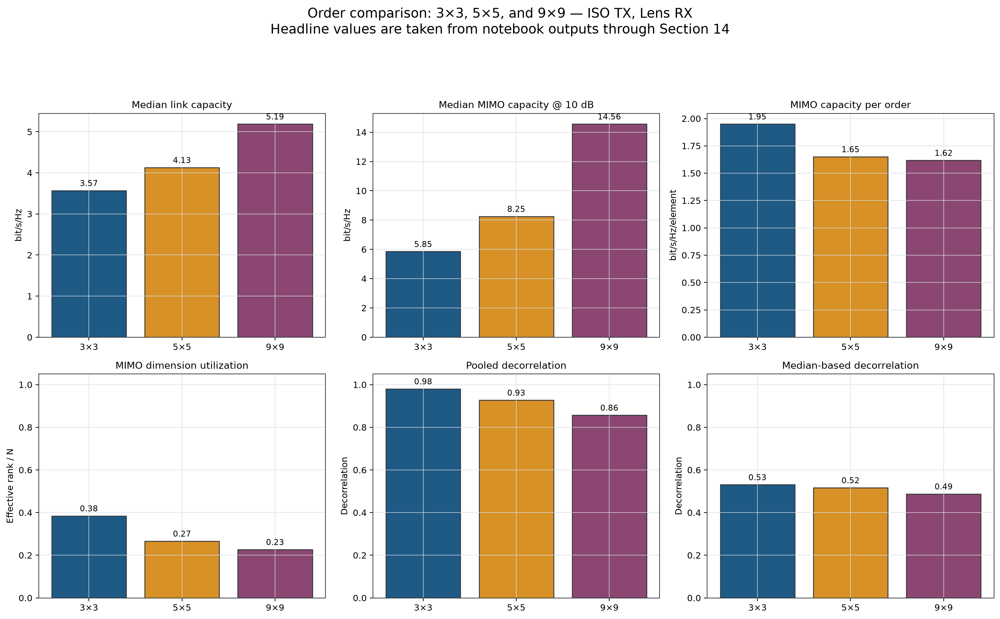
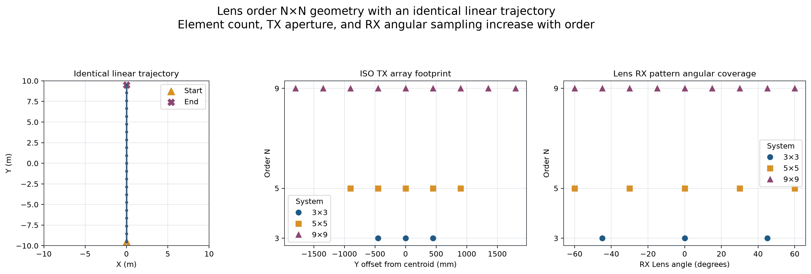
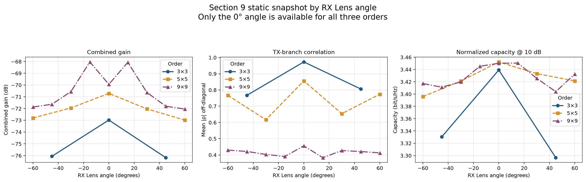
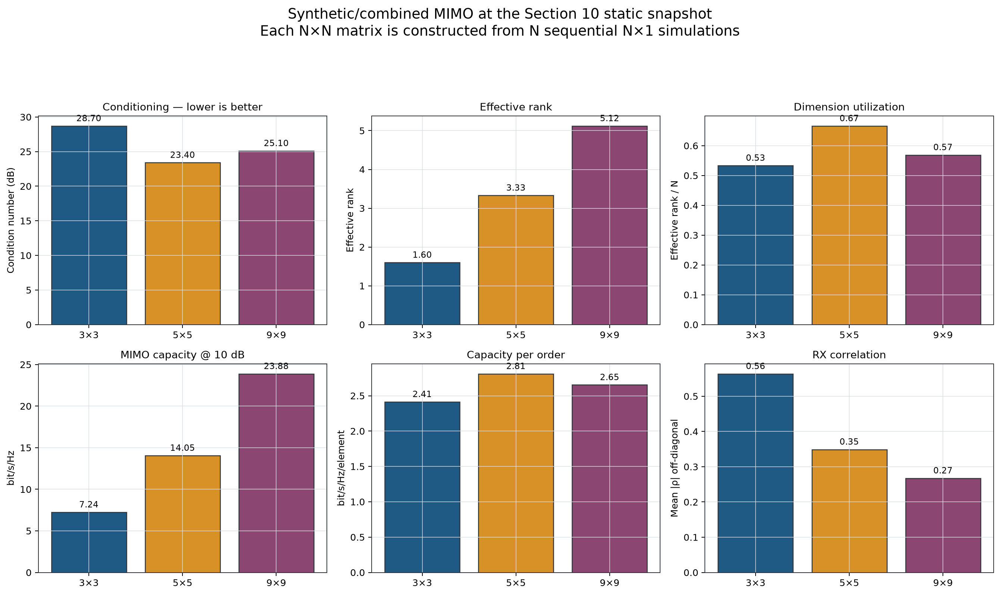
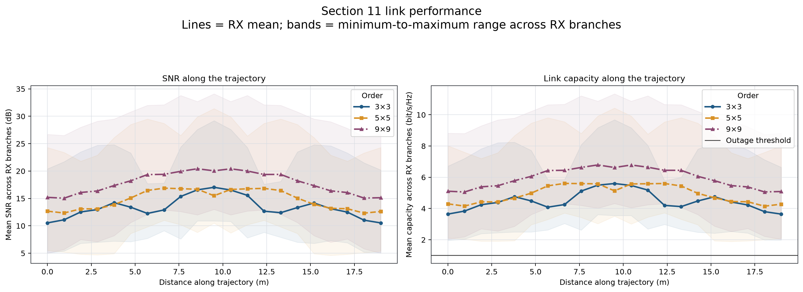
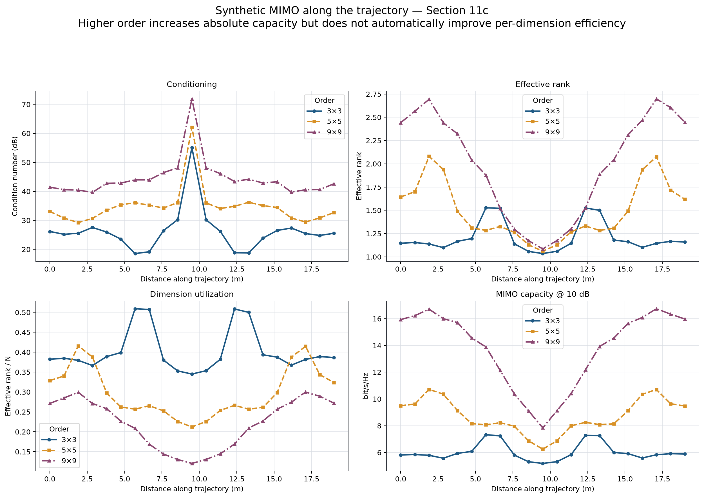
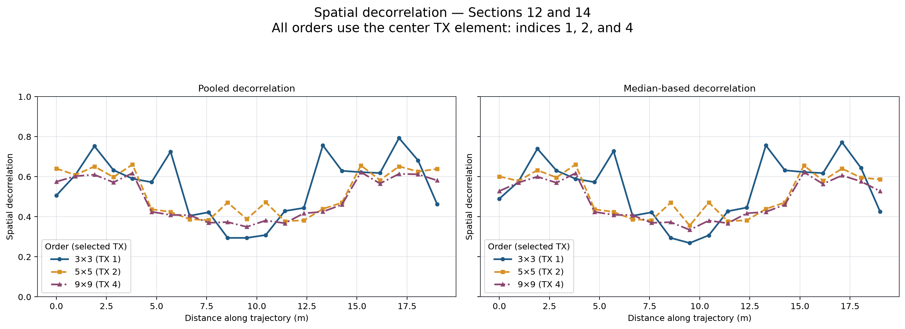
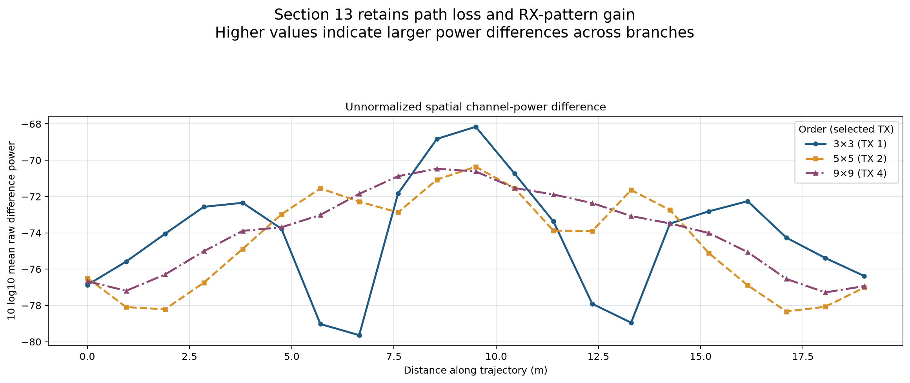

# Analisis Skalabilitas Lens 3×3, 5×5, dan 9×9 dengan TX Isotropik

## 1. Technical summary: kapasitas absolut naik, efisiensi dimensi turun

| Order | Total TX (dBm) | Median \|H\| (dB) | Median link cap. | Median cond. (dB) | Median e-rank | e-rank/N | Median MIMO cap. | MIMO cap./N | Pooled decor. | Median decor. |
| --- | --- | --- | --- | --- | --- | --- | --- | --- | --- | --- |
| 3×3 | 14.77 | -86.75 | 3.57 | 25.55 | 1.15 | 0.385 | 5.85 | 1.95 | 0.9807 | 0.5308 |
| 5×5 | 16.99 | -86.94 | 4.13 | 34.24 | 1.33 | 0.266 | 8.25 | 1.65 | 0.9276 | 0.5166 |
| 9×9 | 19.54 | -86.65 | 5.19 | 42.88 | 2.04 | 0.227 | 14.56 | 1.62 | 0.8570 | 0.4876 |

Kapasitas MIMO median meningkat dari 5.85 menjadi 14.56 bit/s/Hz. Namun kapasitas per order berubah dari 1.95 menjadi 1.62 bit/s/Hz/elemen dan `e-rank/N` turun dari 0.385 menjadi 0.227. Tambahan elemen memberi throughput absolut, tetapi dengan diminishing return pada pemanfaatan dimensi. Kesimpulan ini bersifat deskriptif karena total daya, aperture, dan sampling sudut RX berubah bersama order.

## 2. Tujuan dan pertanyaan analisis

Tujuannya adalah menilai bagaimana peningkatan order dari 3×3 ke 5×5 dan 9×9 memengaruhi kualitas link, conditioning, effective rank, kapasitas MIMO, dan spatial decorrelation. Karena ukuran matriks, jumlah TX/RX, aperture, cakupan sudut RX, dan total daya berubah bersama order, hasil dibaca sebagai **skalabilitas konfigurasi sistem**, bukan efek kausal tunggal dari jumlah elemen.

## 3. Sumber data dan batas Section 14

- [Lens 3×3](../Setupv4_20mx20m_lens_3x3_Patch_iso_LinearTrajectory.ipynb)
- [Lens 5×5](../Setupv4_20mx20m_lens_5x5_Patch_iso_LinearTrajectory.ipynb)
- [Lens 9×9](../Setupv4_20mx20m_lens_9x9_Patch_iso_TrajectoryTxCom.ipynb)

Ketiga notebook memiliki 64 cell, tidak memuat heading Section 15, dan berakhir pada Section 14. Analisis menggunakan output eksekusi yang sudah tersimpan; ray tracing tidak dijalankan ulang. Hash, timestamp, cell scope, serta inventaris figure dicatat di [provenance.json](metadata/provenance.json).

## 4. Setup order dan kesetaraan simulasi

Semua sistem memakai TX pattern `iso`, RX Lens Patch, ruangan 20 m × 20 m × 3 m, carrier dan bandwidth yang sama, 21 waypoint sepanjang 19 m, 16 time step per waypoint, serta 401 frequency bins. Daya ditetapkan 10 dBm **per TX**, sehingga total nominal bertambah dari 14.77 dBm pada 3×3 menjadi 19.54 dBm pada 9×9.

Order 3×3 memiliki sudut RX `−45°, 0°, +45°`; 5×5 memakai `−60°, −30°, 0°, +30°, +60°`; sedangkan 9×9 memakai grid 15° dari −60° sampai +60°. Karena hanya RX 0° yang sama pada semua order, agregat seluruh RX dan perbandingan RX 0° dilaporkan terpisah.

## 5. Definisi metrik dan metode perbandingan

- **Median link capacity** berasal dari link budget notebook pada semua waypoint × RX.
- **Condition number** yang lebih rendah menandakan matriks lebih mudah dipisahkan secara numerik.
- **Effective rank** menunjukkan jumlah dimensi eigenmode yang efektif; `e-rank/N` menormalkannya terhadap order.
- **MIMO capacity @ 10 dB** adalah kapasitas pada SNR ternormalisasi yang digunakan notebook; `capacity/N` menunjukkan efisiensi per dimensi.
- **Pooled decorrelation** menghitung korelasi setelah seluruh realisasi digabung; **median-based** mengambil median korelasi blok waypoint × time.
- Matriks N×N dibentuk dengan menggabungkan N simulasi N×1 yang dilakukan berurutan, bukan N RX aktif simultan.

## 6. Aperture, daya total, dan sampling sudut berubah bersama order

Jarak elemen TX tetap 0,45 m, tetapi aperture bertambah dari 0,9 m (3 TX) menjadi 3,6 m (9 TX). Pada saat yang sama total daya nominal naik 4.77 dB dan jumlah pola RX yang digabung meningkat dari 3 menjadi 9. Karena itu, kenaikan kapasitas absolut tidak dapat diatribusikan hanya pada rank atau aperture.

Perbandingan delta berikut menunjukkan perubahan konfigurasi penuh:

| Perbandingan | Δ total TX (dB) | Δ link cap. | Δ MIMO cap. | Δ MIMO cap./N | Δ cond. (dB) | Δ e-rank/N | Δ capacity RX 0° |
| --- | --- | --- | --- | --- | --- | --- | --- |
| 3x3→5x5 | +2.22 | +0.56 | +2.40 | -0.30 | +8.69 | -0.118 | +0.70 |
| 5x5→9x9 | +2.55 | +1.06 | +6.31 | -0.03 | +8.64 | -0.039 | +0.72 |
| 3x3→9x9 | +4.77 | +1.62 | +8.71 | -0.33 | +17.33 | -0.158 | +1.43 |

## 7. Snapshot RX Section 9: sudut 0° adalah baseline paling sebanding

Kurva per sudut memperlihatkan bahwa populasi RX berubah antar-order. Untuk mengurangi bias sampling sudut, RX 0° dibandingkan secara khusus:

| Order | 0° \|H\| (dB) | 0° SNR (dB) | 0° capacity |
| --- | --- | --- | --- |
| 3×3 | -86.85 | 10.70 | 3.54 |
| 5×5 | -86.94 | 12.76 | 4.24 |
| 9×9 | -87.41 | 14.96 | 4.96 |

Kapasitas median RX 0° berubah dari 3.54 pada 3×3 menjadi 4.96 bit/s/Hz pada 9×9. Ini tetap bukan uji constant-total-power karena daya nominal bertambah seiring jumlah TX.

## 8. Snapshot MIMO Section 10: 5×5 memiliki conditioning statis terbaik

Pada snapshot statis, conditioning tidak monotonik: 5×5 adalah yang terbaik (23.40 dB), diikuti 9×9 (25.10 dB), kemudian 3×3 (28.70 dB). Effective rank absolut dan kapasitas meningkat dengan order, sedangkan `e-rank/N` serta capacity/N menunjukkan bahwa 5×5 paling efisien pada snapshot ini. Hasil statis tersebut berbeda dari median sepanjang trajectory, tempat condition number memburuk secara monotonik dengan order.

## 9. Link sepanjang trajectory: kenaikan order memberi gain kapasitas bertahap

Median kapasitas link meningkat dari 3.57 (3×3), 4.13 (5×5), menjadi 5.19 bit/s/Hz (9×9), sementara median magnitude kanal hanya berubah dalam rentang 0.29 dB. Perbedaan ini konsisten dengan link budget yang mengakumulasi kontribusi lebih banyak TX. Semua order mencatat outage 0% pada ambang 1 bit/s/Hz, sehingga threshold ini tidak mampu membedakan reliabilitas antarkonfigurasi. Pita figure adalah minimum–maksimum antar-RX, bukan confidence interval.

## 10. MIMO sepanjang trajectory: bottleneck pusat ruangan muncul pada semua order

Ketiga order memperlihatkan lonjakan condition number dan penurunan capacity/effective rank di sekitar jarak 9,5 m, yaitu pusat trajectory. Nilai condition maksimum adalah 55.09 dB (3×3), 62.06 dB (5×5), dan 71.89 dB (9×9). Pola yang konsisten menunjukkan bottleneck geometrik/propagasi pada lokasi tersebut, sementara keparahannya meningkat dengan order.

## 11. Spatial decorrelation: kedua estimator menurun dengan order

Pooled decorrelation turun dari 0.9807 menjadi 0.9276 dan 0.8570 ketika jumlah cabang bertambah. Median-based decorrelation juga turun secara konsisten: 0.5308, 0.5166, lalu 0.4876. Setelah koreksi 5×5, ketiga sistem memakai elemen TX tengah—indeks 1, 2, dan 4—sehingga pemilihan TX pada Sections 12–14 kini setara. Tren ini mendukung indikasi bahwa respons antarcabang menjadi lebih berkorelasi pada order yang lebih besar, meskipun grid sudut RX masih berbeda.

## 12. Raw spatial Section 13: perbedaan daya tidak menunjukkan scaling monotonik

Mean raw difference power adalah 4.863e-08 (3×3), 4.205e-08 (5×5), dan 4.628e-08 (9×9). Walaupun TX terpilih kini sama-sama elemen tengah, metrik ini mempertahankan path loss dan gain pola serta tetap sensitif terhadap distribusi RX. Tidak adanya tren monotonik menunjukkan bahwa raw difference power bukan indikator skalabilitas tunggal tanpa penyamaan grid sudut RX.

## 13. Diskusi, keterbatasan, dan hasil validasi

Temuan yang paling kuat adalah kenaikan kapasitas MIMO absolut dan memburuknya conditioning ketika order meningkat. Temuan mengenai efisiensi per dimensi lebih informatif daripada kapasitas absolut karena kapasitas mentah diuntungkan oleh jumlah dimensi dan total daya yang lebih besar.

Keterbatasan utama:

1. Daya 10 dBm ditetapkan per TX; tidak ada normalisasi constant-total-power.
2. Sudut dan jumlah konfigurasi RX berbeda antar-order; hanya RX 0° yang benar-benar sama.
3. MIMO N×N adalah konstruksi dari simulasi RX berurutan.
4. Hanya satu scene/output tersimpan, tanpa multi-seed atau convergence sweep; path sampling menggunakan 100.000 paths/source.
5. Outage threshold 1 bit/s/Hz jenuh pada 0% untuk semua order.

Status validasi adalah **share with caveats**. Pemeriksaan angka, row count, identitas korelasi/dekorelasi, invariant TX ISO, dan figure tersedia pada [VALIDATION.md](VALIDATION.md).

## 14. Summary, rekomendasi, dan pertanyaan lanjutan

**Summary.** Order yang lebih besar meningkatkan kapasitas absolut: median MIMO capacity bertambah 8.71 bit/s/Hz dari 3×3 ke 9×9. Akan tetapi, conditioning memburuk 17.33 dB dan `e-rank/N` turun -0.158, sehingga scaling tidak linear terhadap jumlah elemen.

Rekomendasi berikutnya:

1. Ulangi dengan **total daya TX konstan** dan alokasikan daya `P_total/N` per elemen.
2. Gunakan subset RX yang identik—minimal 0°, idealnya grid sudut sama—pada semua order.
3. Pertahankan aturan `SPATIAL_DECORR_TX_INDEX = N//2` agar evaluasi spatial selalu memakai TX tengah.
4. Tambahkan multi-seed dan 1.000.000 path samples/source untuk convergence check.
5. Laporkan outage pada threshold tambahan 4, 5, dan 6 bit/s/Hz serta percentile kapasitas.

Pertanyaan lanjutan yang paling penting adalah apakah keunggulan kapasitas 9×9 tetap bertahan setelah total daya dan grid sudut RX dibuat identik. Pemilihan TX spatial sudah diperbaiki menjadi elemen tengah pada seluruh order. Laporan ini berhenti pada Section 14; data terstruktur tersedia di [data](data/), figure komparatif berbahasa Inggris dan figure sumber asli di [figures](figures/), serta provenance/QA di [metadata](metadata/). Versi MATLAB berbahasa Inggris tersedia melalui [panduan plotting MATLAB](MATLAB_PLOTTING.md).
