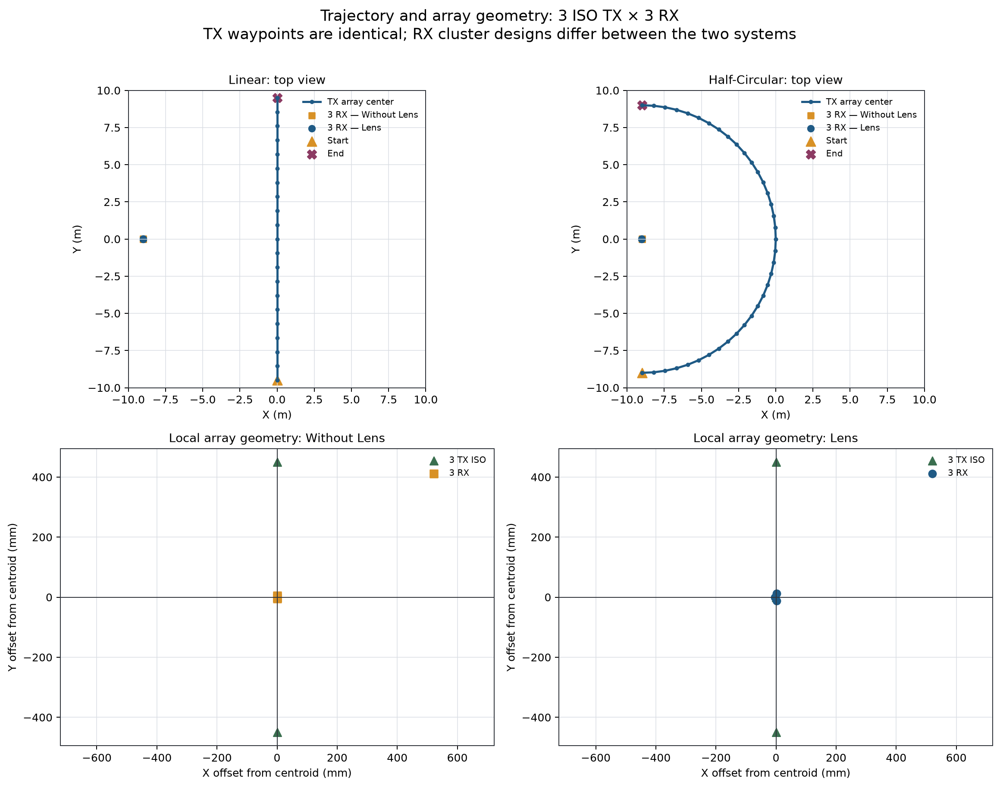
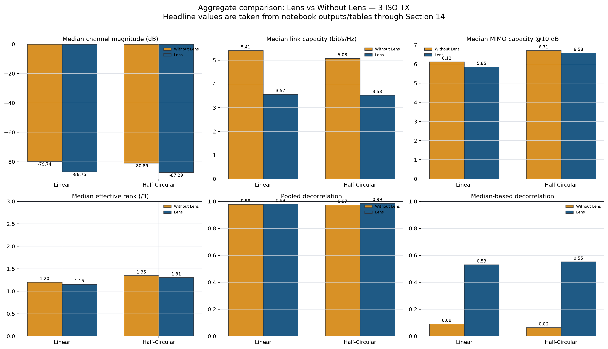
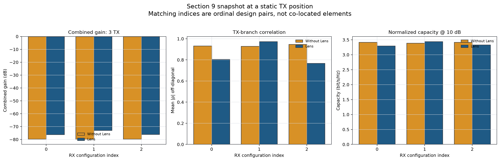
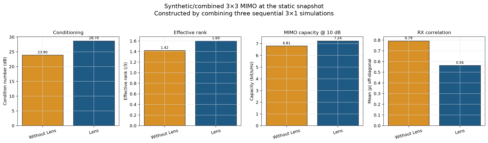
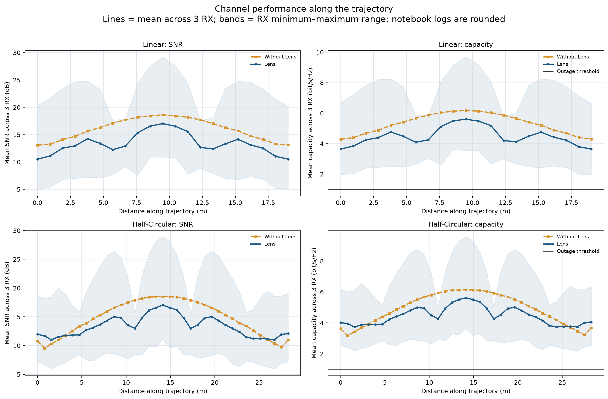
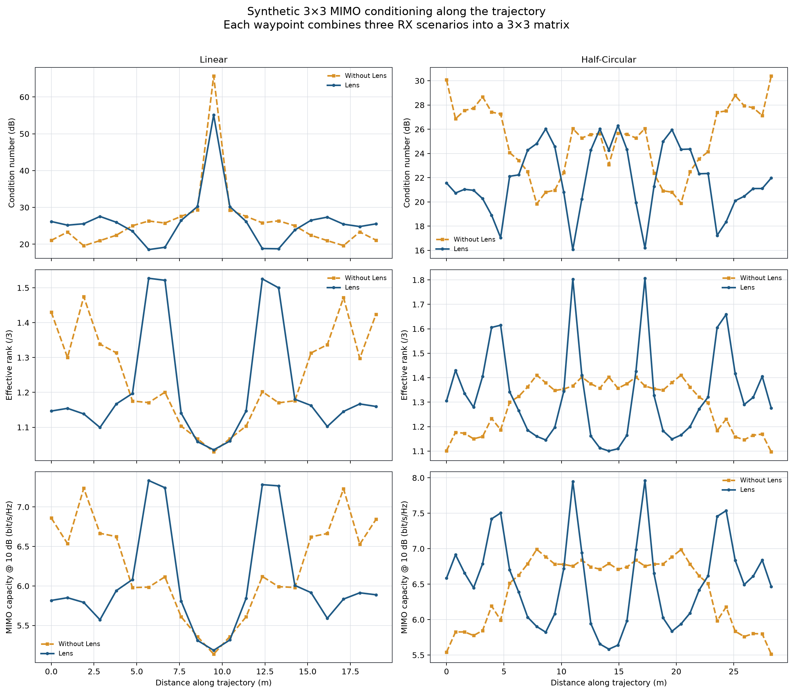
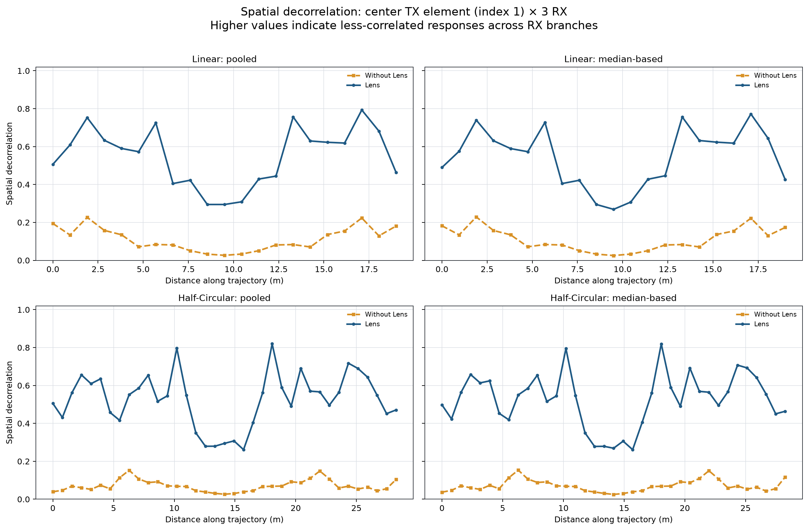
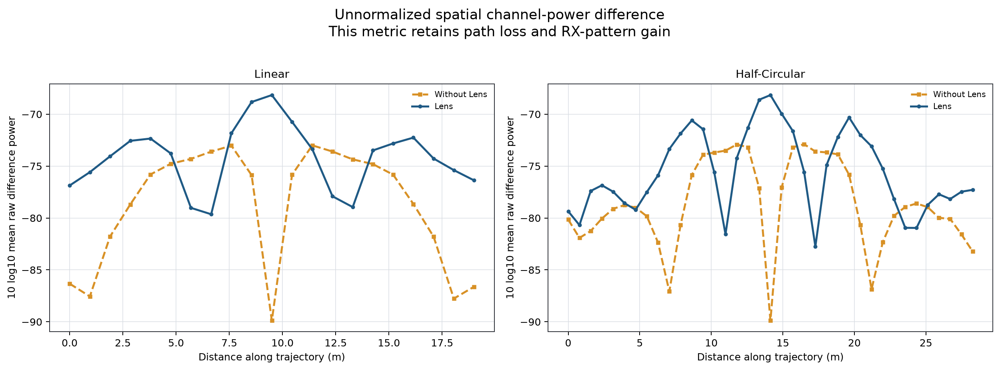

# Analisis 3-TX Isotropik: Lens vs Without Lens pada Trajectory Linear dan Half-Circular

> **Batas analisis:** hanya Sections 1–14 dari empat notebook. Tidak ada Section 15 yang digunakan atau dibuat.  
> **Dibangun:** 2026-08-17 09:31 Taipei Standard Time dari output notebook yang sudah tersimpan; ray tracing tidak dijalankan ulang.

## 1. Tujuan dan pertanyaan analisis

Laporan ini membandingkan sistem RX Lens dan Without Lens ketika satu user membawa array tiga TX dengan pola isotropik (`TX_PATTERN_MODE="iso"`). Dua skenario mobilitas yang sebenarnya terdapat di notebook adalah trajectory **Linear** dan **Half-Circular**. Fokusnya adalah link budget per skenario RX, kapasitas, conditioning MIMO 3×3 yang dibentuk dari tiga simulasi 3×1, dan spatial decorrelation sampai Section 14.

## 2. Sumber data dan batas Section 14

- [Without Lens — Linear](../Setupv4_20mx20m_wolens_3x3_Patch_iso_randomCom.ipynb)
- [Without Lens — Half-Circular](../Setupv4_20mx20m_wolens_3x3_Patch_iso_CircularTrajectoryTxCom.ipynb)
- [Lens — Linear](../Setupv4_20mx20m_lens_3x3_Patch_iso_LinearTrajectory.ipynb)
- [Lens — Half-Circular](../Setupv4_20mx20m_lens_3x3_Patch_iso_CircularTrajectoryTxCom.ipynb)

Walaupun notebook pertama bernama `randomCom`, heading dan parameternya menunjukkan trajectory linear deterministik 21 waypoint. Seluruh notebook hanya memiliki Sections 1–14. Angka headline diambil dari stream summary presisi penuh dan tabel HTML notebook; log per waypoint yang dibulatkan dipakai untuk bentuk kurva. Hash, cell scope, dan inventaris output disimpan di [provenance.json](metadata/provenance.json).

## 3. Setup 3-TX ISO dan kesetaraan simulasi

Keempat skenario menggunakan ruang 20 m × 20 m × 3 m, tiga TX isotropik simultan, tiga skenario RX, 38 GHz, bandwidth 400 MHz, 401 frequency bins, sampling mobilitas 1 kHz, 16 time-step/waypoint, daya total yang dihitung dari 10 dBm per TX, noise figure 7 dB, dan 100.000 path samples per source. Linear memiliki 21 waypoint sepanjang 19 m; half-circular memiliki 37 waypoint pada radius 9 m sepanjang 28,27 m.

Waypoint dan geometri array TX sama antarperlakuan. Namun, seperti pada setup Lens proyek ini, cluster RX Lens melengkung dan memakai pola far-field +60° hingga −60°, sedangkan RX Without Lens tersusun linear dan memakai pola patch yang sama. Karena itu, delta yang dilaporkan adalah efek **desain sistem RX lengkap**, bukan isolasi material Lens pada koordinat RX identik.

Gambar menegaskan lintasan pusat array TX yang berpasangan dan menunjukkan perbedaan geometri RX yang harus dipertimbangkan saat membaca hasil.

## 4. Definisi metrik dan metode

- **Combined gain** Section 9 menggabungkan energi tiga cabang TX pada satu skenario RX.
- **Kapasitas link trajectory** berasal dari link budget 3-TX ke satu RX aktif, bukan kapasitas MIMO simultan tiga RX.
- **MIMO 3×3 sintetis/tergabung** dibentuk dengan menumpuk tiga hasil simulasi 3×1 pada posisi/sudut RX berbeda; condition number lebih rendah dan effective rank lebih tinggi umumnya lebih baik.
- **Pooled decorrelation** adalah `1-|ρ|` setelah seluruh realisasi waypoint × time × frequency digabung untuk TX elemen tengah (indeks 1).
- **Median-based decorrelation** menghitung korelasi per time block lalu mengambil median.
- **Raw difference power** mempertahankan skala energi, sehingga membawa pengaruh path loss dan gain antena.

Delta selalu **Lens − Without Lens**. Untuk condition number, delta negatif menguntungkan; untuk gain, kapasitas, effective rank, dan decorrelation, delta positif biasanya menguntungkan sesuai konteks.

## 5. Ringkasan hasil utama

| Trajectory | Sistem | Median |H| (dB) | Median C link | Median cond. (dB) | Median e-rank | Median C MIMO | Dekor. pooled | Dekor. median |
| --- | --- | --- | --- | --- | --- | --- | --- | --- |
| Linear | Without Lens | -79.74 | 5.41 | 25.01 | 1.20 | 6.12 | 0.9784 | 0.0909 |
| Half-Circular | Without Lens | -80.89 | 5.08 | 25.58 | 1.35 | 6.71 | 0.9744 | 0.0638 |
| Linear | Lens | -86.75 | 3.57 | 25.55 | 1.15 | 5.85 | 0.9807 | 0.5308 |
| Half-Circular | Lens | -87.29 | 3.53 | 21.56 | 1.31 | 6.58 | 0.9872 | 0.5518 |

**Efek Lens pada konfigurasi 3-TX ISO bersifat trajectory-dependent.** Delta Lens − Without Lens untuk median magnitude adalah -7.01 dB pada linear dan -6.40 dB pada half-circular; delta median kapasitas link masing-masing -1.84 dan -1.55 bit/s/Hz. Outage pada ambang 1 bit/s/Hz adalah 0.00%/0.00% (Without Lens/Lens) untuk linear dan 0.00%/0.00% untuk half-circular.

Hasil agregat memperlihatkan trade-off antara link budget, effective rank, conditioning, kapasitas MIMO, dan dua estimator decorrelation. Arah serta besar setiap perubahan dibaca dari tabel delta Lens − Without Lens, bukan diasumsikan dari satu metrik saja.

## 6. Snapshot Section 9: Lens sangat selektif antar-sudut RX

Without Lens memakai pola patch yang sama pada tiga posisi, sedangkan Lens memakai tiga respons far-field berbeda (+45°, 0°, −45°). Karena itu Lens dapat menunjukkan rentang combined gain yang lebih lebar. Capacity @10 dB pada panel ini sudah dinormalisasi dan tidak merepresentasikan link-budget capacity absolut. Pasangan indeks adalah ordinal desain, bukan elemen co-located.

## 7. Snapshot MIMO Section 10: conditioning, rank, dan capacity

Pada matriks 3×3 snapshot, condition number median berubah dari 23.9 menjadi 28.7 dB. Effective rank berubah dari 1.42 menjadi 1.60, dan capacity @10 dB dari 6.81 ke 7.24 bit/s/Hz. Pada snapshot 3×3 ini Lens menaikkan rank/capacity ternormalisasi, tetapi memperbesar condition number; satu statistik saja tidak cukup menilai kualitas multiplexing.

## 8. Trajectory linear: Without Lens unggul pada median link

Median kanal linear adalah -79.74 dB Without Lens dan -86.75 dB Lens. Kapasitas median berubah dari 5.41 menjadi 3.57 bit/s/Hz. Lens memberikan cabang yang sangat kuat pada sebagian posisi/sudut, tetapi juga cabang lemah; median seluruh pasangan waypoint–RX menjadi lebih rendah.

Pita minimum–maksimum memperlihatkan bahwa variasi antar-beam Lens jauh lebih besar. Tanpa beam selection, median agregat menghukum sudut Lens yang tidak sejajar dengan arah datang dominan. Dengan strategi memilih beam terbaik, kesimpulan operasional dapat berubah dan perlu diuji terpisah.

## 9. Half-circular: perubahan performa terhadap lintasan melengkung

Pada half-circular, median kanal adalah -80.89 dB Without Lens vs -87.29 dB Lens; median kapasitas 5.08 vs 3.53 bit/s/Hz. Lintasan melengkung menyapu sudut datang dan jarak yang lebih beragam, sehingga efek Lens perlu dibaca terpisah dari hasil linear.

Tidak ada outage pada kedua sistem. Untuk skenario ini, evaluasi reliability sebaiknya memakai threshold lebih tinggi—misalnya 5 atau 6 bit/s/Hz—atau melaporkan percentile capacity, karena threshold 1 bit/s/Hz berada terlalu jauh di bawah seluruh hasil.

## 10. Conditioning MIMO sepanjang trajectory

Pada linear, median capacity MIMO @10 dB berubah dari 6.12 menjadi 5.85 bit/s/Hz dan effective rank dari 1.20 menjadi 1.15. Half-circular memberi capacity MIMO median lebih tinggi daripada linear untuk kedua sistem. Pada half-circular Lens mencapai 6.58 vs 6.71 bit/s/Hz.

Titik tengah linear memperlihatkan lonjakan condition number dan penurunan rank/capacity yang tajam. Half-circular menaikkan effective rank dan capacity median pada kedua sistem, tetapi condition number median sedikit memburuk untuk Without Lens dan membaik untuk Lens.

## 11. Efek Lens langsung pada dua trajectory

| Trajectory | Δ |H| (dB) | Δ C link | Δ C link (%) | Δ cond. (dB) | Δ e-rank | Δ C MIMO | Δ dekor. pooled | Δ dekor. median |
| --- | --- | --- | --- | --- | --- | --- | --- | --- |
| Linear | -7.01 | -1.84 | -34.01 | +0.55 | -0.05 | -0.27 | +0.00 | +0.44 |
| Half-Circular | -6.40 | -1.55 | -30.51 | -4.02 | -0.04 | -0.13 | +0.01 | +0.49 |

Efek Lens konsisten negatif untuk median magnitude, link capacity, effective rank, dan MIMO capacity. Condition number berubah +0.55 dB pada linear dan -4.02 dB pada half-circular; hanya delta negatif yang berarti conditioning membaik. Satu statistik conditioning tidak otomatis menentukan kapasitas.

## 12. Spatial decorrelation Sections 12–14

Pooled decorrelation berubah dari 0.9784 ke 0.9807 pada linear, dan dari 0.9744 ke 0.9872 pada half-circular. Median-based decorrelation berubah dari 0.0909 ke 0.5308 pada linear dan dari 0.0638 ke 0.5518 pada half-circular.

Kedua estimator menunjukkan kenaikan decorrelation dengan Lens, tetapi skalanya sangat berbeda: pooled hanya naik tipis, sedangkan median-based naik kuat. Pooled merangkum struktur global setelah seluruh realisasi digabung, sedangkan median-based menggambarkan blok waktu tipikal. Karena Sections 12–14 hanya memilih TX elemen 1, hasil ini tidak identik dengan korelasi penuh matriks 3×3 Section 10.

Raw difference power menambahkan konteks amplitudo. Nilainya tidak boleh disamakan dengan decorrelation ternormalisasi karena gain yang lebih besar pada beberapa Lens angle dapat memperbesar perbedaan absolut walaupun median link keseluruhan turun.

## 13. Diskusi, keterbatasan, dan validitas

**Mengapa median Lens dapat berbeda dari beam terbaiknya?** Laporan mengagregasi seluruh tiga RX Lens angle dengan bobot sama. Directional Lens dapat menghasilkan distribusi lebar: beam yang aligned kuat, sementara beam lain lebih lemah. Patch Without Lens cenderung lebih seragam. Karena itu hasil agregat tanpa beam selection tidak sama dengan performa best-beam.

**Apa pengaruh half-circular pada MIMO?** Lintasan melengkung meningkatkan median effective rank/capacity MIMO pada kedua sistem, tetapi dampaknya pada condition number berbeda antara Lens dan Without Lens. Temuan ini tetap deskriptif karena distribusi posisi dan jarak juga berbeda.

**Keterbatasan utama:**

- Matriks 3×3 dibentuk dari tiga simulasi RX 3×1 yang berurutan; simultanitas, mutual coupling, dan konsistensi fase hardware antar-RX belum dimodelkan.
- Cluster RX Lens dan Without Lens berbeda geometri serta pola; ini bukan A/B test pada koordinat identik.
- Hanya satu scene/configuration dan tidak ada multi-seed atau confidence interval.
- Path samples masih 100.000 per source; catatan notebook merekomendasikan 1.000.000 untuk hasil final.
- Kurva SNR/capacity berasal dari log yang dibulatkan; angka headline memakai summary/tabel presisi penuh.
- Threshold outage 1 bit/s/Hz menghasilkan 0% untuk semua kasus dan tidak informatif.

Status validasi adalah **share with caveats**. Pemeriksaan terperinci tersedia pada [VALIDATION.md](VALIDATION.md).

## 14. Summary dan kesimpulan

1. **Efek Lens pada median link harus dibaca per trajectory.** Delta Lens − Without Lens adalah -7.01 dB/-1.84 bit/s/Hz pada linear dan -6.40 dB/-1.55 bit/s/Hz pada half-circular.
2. **Outage 1 bit/s/Hz adalah metrik jenuh.** Semua skenario mencatat 0%; gunakan threshold atau percentile yang lebih ketat.
3. **Lens menawarkan beam selectivity, bukan gain seragam.** Performa agregat tiga beam perlu dilengkapi evaluasi best-beam atau practical beam selection.
4. **MIMO trajectory juga memihak Without Lens.** Effective rank dan capacity median lebih tinggi pada kedua trajectory.
5. **Half-circular menaikkan effective rank dan capacity MIMO median.** Namun condition number median membaik pada Lens dan sedikit memburuk pada Without Lens, sehingga arah perbaikan tidak seragam untuk semua metrik.
6. **Lens menaikkan decorrelation pada kedua estimator.** Kenaikan pooled adalah +0.0023 (linear) dan +0.0128 (half-circular); kenaikan median-based masing-masing +0.4399 dan +0.4880.
7. **Langkah berikutnya:** bandingkan average-all-beams dengan oracle dan practical beam selection, gunakan RX co-located untuk isolasi pola, naikkan ray samples, lakukan multi-seed, dan simpan CFR mentah agar interval serta mekanisme spatial dapat diuji.

Laporan berhenti pada Section 14. CSV tersedia di [data](data/), figure komparatif dan figure sumber di [figures](figures/), serta provenance dan QA di [metadata](metadata/).
