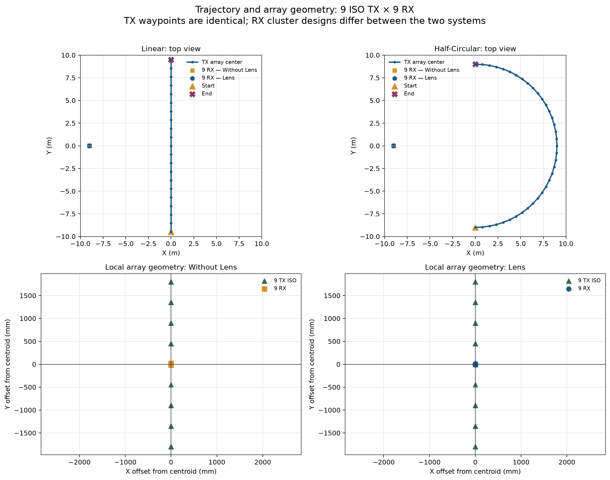
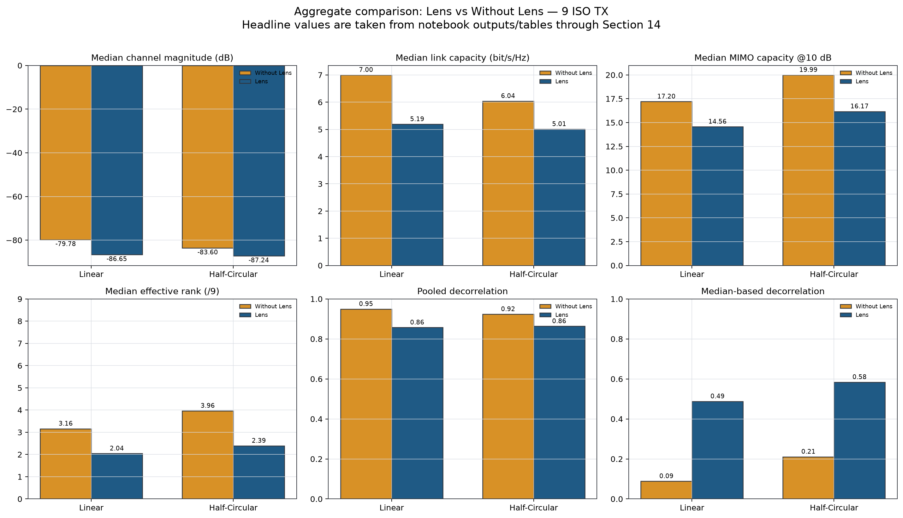
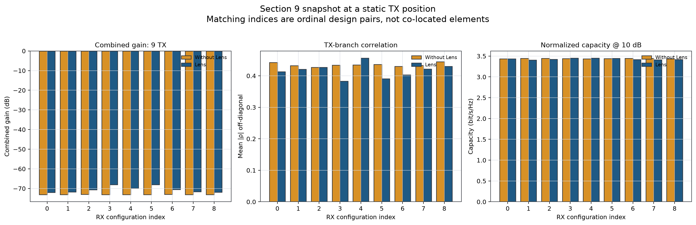
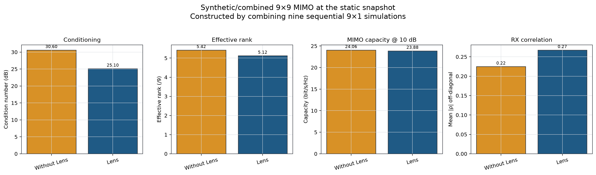
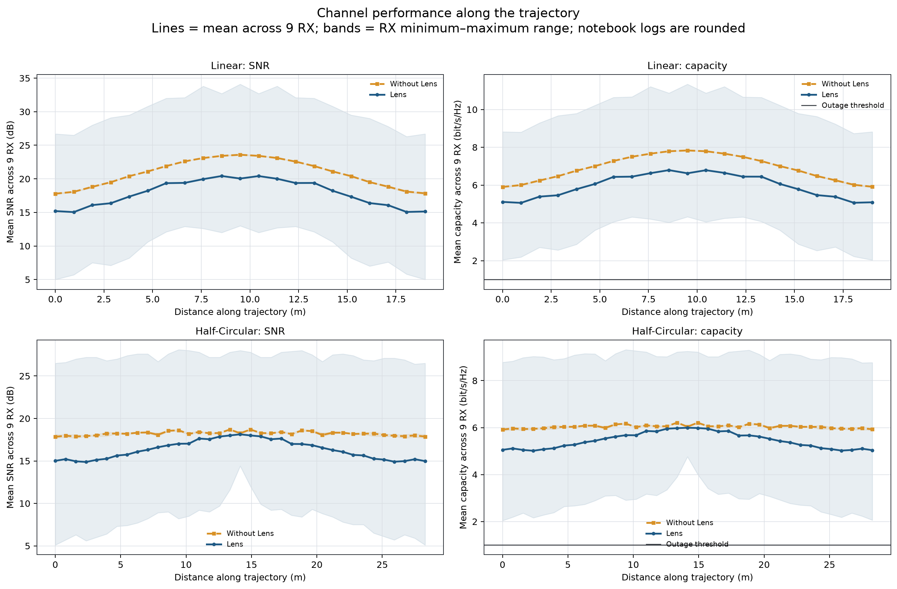
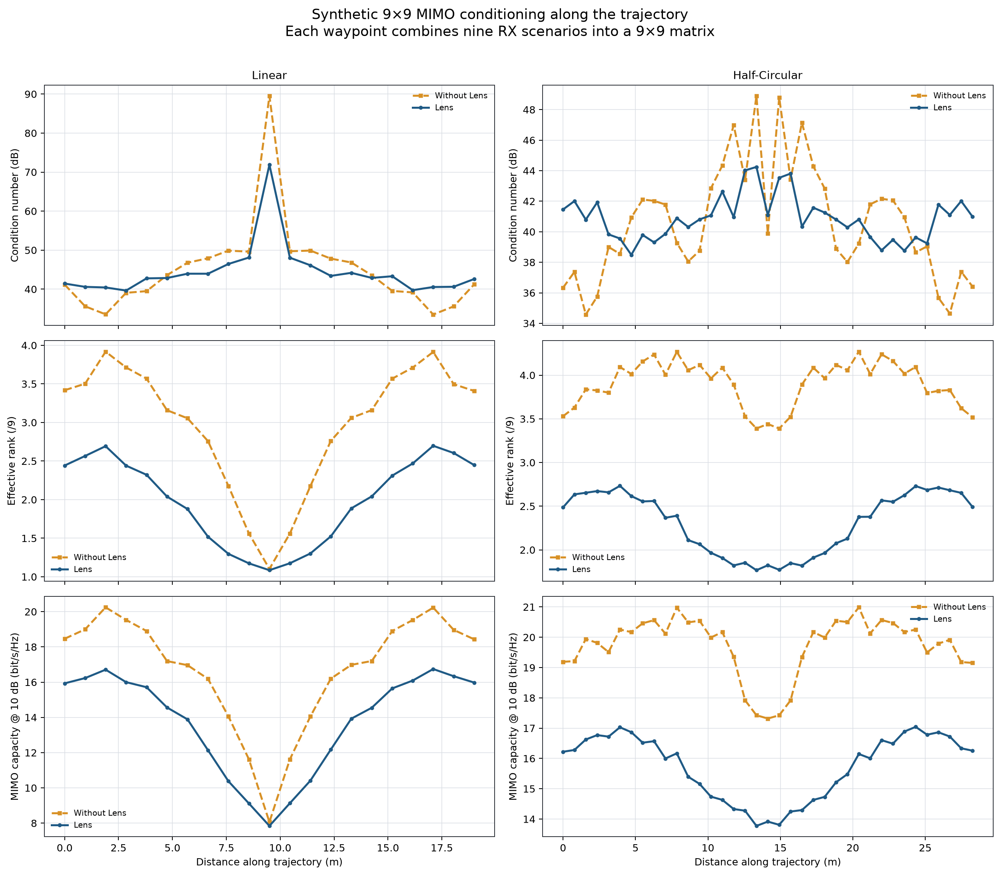
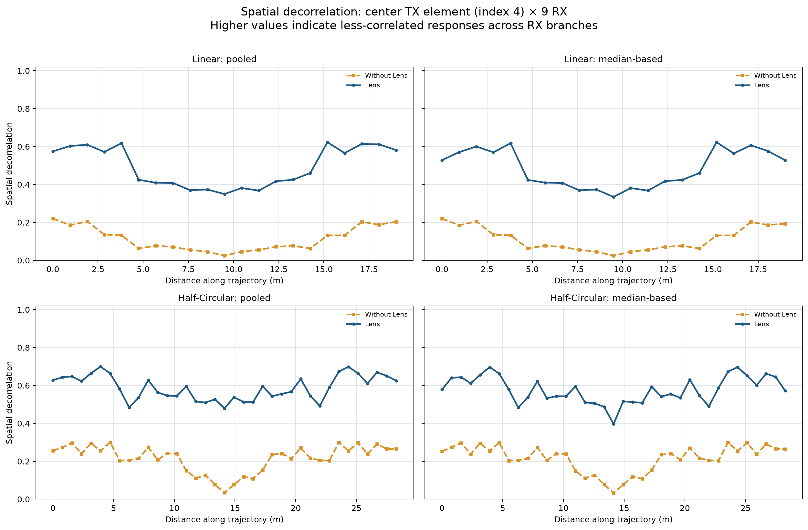
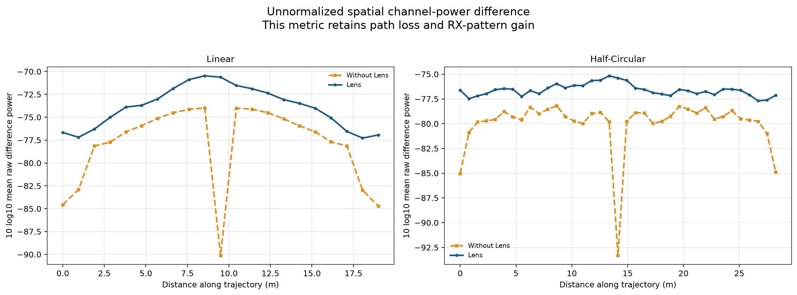

# Analisis 9-TX Isotropik: Lens vs Without Lens pada Trajectory Linear dan Half-Circular

> **Batas analisis:** hanya Sections 1–14 dari empat notebook. Tidak ada Section 15 yang digunakan atau dibuat.  
> **Dibangun:** 2026-08-14 05:45 Taipei Standard Time dari output notebook yang sudah tersimpan; ray tracing tidak dijalankan ulang.

## 1. Tujuan dan pertanyaan analisis

Laporan ini membandingkan sistem RX Lens dan Without Lens ketika satu user membawa array sembilan TX dengan pola isotropik (`TX_PATTERN_MODE="iso"`). Dua skenario mobilitas yang sebenarnya terdapat di notebook adalah trajectory **Linear** dan **Half-Circular**. Fokusnya adalah link budget per skenario RX, kapasitas, conditioning MIMO 9×9 yang dibentuk dari sembilan simulasi 9×1, dan spatial decorrelation sampai Section 14.

## 2. Sumber data dan batas Section 14

- [Without Lens — Linear](../Setupv4_20mx20m_wolens_9x9_Patch_iso_randomCom.ipynb)
- [Without Lens — Half-Circular](../Setupv4_20mx20m_wolens_9x9_Patch_iso_CircularTrajectoryTxCom.ipynb)
- [Lens — Linear](../Setupv4_20mx20m_lens_9x9_Patch_iso_TrajectoryTxCom.ipynb)
- [Lens — Half-Circular](../Setupv4_20mx20m_lens_9x9_Patch_iso_CircularTrajectoryTxCom.ipynb)

Walaupun notebook pertama bernama `randomCom`, heading dan parameternya menunjukkan trajectory linear deterministik 21 waypoint. Seluruh notebook hanya memiliki Sections 1–14. Angka headline diambil dari stream summary presisi penuh dan tabel HTML notebook; log per waypoint yang dibulatkan dipakai untuk bentuk kurva. Hash, cell scope, dan inventaris output disimpan di [provenance.json](metadata/provenance.json).

## 3. Setup 9-TX ISO dan kesetaraan simulasi

Keempat skenario menggunakan ruang 20 m × 20 m × 3 m, sembilan TX isotropik simultan, sembilan skenario RX, 38 GHz, bandwidth 400 MHz, 401 frequency bins, sampling mobilitas 1 kHz, 16 time-step/waypoint, daya total yang dihitung dari 10 dBm per TX, noise figure 7 dB, dan 100.000 path samples per source. Linear memiliki 21 waypoint sepanjang 19 m; half-circular memiliki 37 waypoint pada radius 9 m sepanjang 28,27 m.

Waypoint dan geometri array TX sama antarperlakuan. Namun, seperti pada setup Lens proyek ini, cluster RX Lens melengkung dan memakai pola far-field +60° hingga −60°, sedangkan RX Without Lens tersusun linear dan memakai pola patch yang sama. Karena itu, delta yang dilaporkan adalah efek **desain sistem RX lengkap**, bukan isolasi material Lens pada koordinat RX identik.

Gambar menegaskan lintasan pusat array TX yang berpasangan dan menunjukkan perbedaan geometri RX yang harus dipertimbangkan saat membaca hasil.

## 4. Definisi metrik dan metode

- **Combined gain** Section 9 menggabungkan energi sembilan cabang TX pada satu skenario RX.
- **Kapasitas link trajectory** berasal dari link budget 9-TX ke satu RX aktif, bukan kapasitas MIMO simultan sembilan RX.
- **MIMO 9×9 sintetis/tergabung** dibentuk dengan menumpuk sembilan hasil simulasi 9×1 pada posisi/sudut RX berbeda; condition number lebih rendah dan effective rank lebih tinggi umumnya lebih baik.
- **Pooled decorrelation** adalah `1-|ρ|` setelah seluruh realisasi waypoint × time × frequency digabung untuk TX elemen tengah (indeks 4).
- **Median-based decorrelation** menghitung korelasi per time block lalu mengambil median.
- **Raw difference power** mempertahankan skala energi, sehingga membawa pengaruh path loss dan gain antena.

Delta selalu **Lens − Without Lens**. Untuk condition number, delta negatif menguntungkan; untuk gain, kapasitas, effective rank, dan decorrelation, delta positif biasanya menguntungkan sesuai konteks.

## 5. Ringkasan hasil utama

| Trajectory | Sistem | Median |H| (dB) | Median C link | Median cond. (dB) | Median e-rank | Median C MIMO | Dekor. pooled | Dekor. median |
| --- | --- | --- | --- | --- | --- | --- | --- | --- |
| Linear | Without Lens | -79.78 | 7.00 | 43.56 | 3.16 | 17.20 | 0.9493 | 0.0885 |
| Half-Circular | Without Lens | -83.60 | 6.04 | 39.90 | 3.96 | 19.99 | 0.9236 | 0.2109 |
| Linear | Lens | -86.65 | 5.19 | 42.88 | 2.04 | 14.56 | 0.8570 | 0.4876 |
| Half-Circular | Lens | -87.24 | 5.01 | 40.81 | 2.39 | 16.17 | 0.8634 | 0.5840 |

**Pada konfigurasi 9-TX ISO ini, Lens tidak meningkatkan median link trajectory.** Median magnitude turun 6.87 dB pada linear dan 3.64 dB pada half-circular. Median kapasitas link ikut turun 1.81 dan 1.03 bit/s/Hz. Semua skenario tetap memiliki outage 0% pada ambang 1 bit/s/Hz, sehingga outage tidak mampu membedakan desain pada link budget ini.

Hasil agregat memperlihatkan trade-off: Lens meningkatkan median-based decorrelation dengan kuat, tetapi link budget, effective rank, dan kapasitas MIMO trajectory lebih rendah.

## 6. Snapshot Section 9: Lens sangat selektif antar-sudut RX

Without Lens menghasilkan combined gain yang hampir seragam sekitar −73,1 dB pada sembilan posisi. Lens menunjukkan rentang yang jauh lebih lebar karena setiap cabang mewakili sudut far-field berbeda. Pada snapshot tertentu beberapa Lens angle sangat kuat, tetapi kapasitas @10 dB setelah normalisasi tetap sekitar 3 bit/s/Hz dan tidak merepresentasikan link-budget capacity absolut. Pasangan indeks adalah ordinal desain, bukan elemen co-located.

## 7. Snapshot MIMO Section 10: conditioning membaik, capacity hampir tetap

Pada matriks 9×9 snapshot, condition number median membaik dari 30.6 menjadi 25.1 dB. Namun effective rank turun dari 5.42 menjadi 5.12, dan capacity @10 dB sedikit turun dari 24.06 ke 23.88 bit/s/Hz. Satu condition number saja tidak cukup menilai kualitas multiplexing.

## 8. Trajectory linear: Without Lens unggul pada median link

Median kanal linear adalah -79.78 dB Without Lens dan -86.65 dB Lens. Kapasitas median berubah dari 7.00 menjadi 5.19 bit/s/Hz. Lens memberikan cabang yang sangat kuat pada sebagian posisi/sudut, tetapi juga cabang lemah; median seluruh pasangan waypoint–RX menjadi lebih rendah.

Pita minimum–maksimum memperlihatkan bahwa variasi antar-beam Lens jauh lebih besar. Tanpa beam selection, median agregat menghukum sudut Lens yang tidak sejajar dengan arah datang dominan. Dengan strategi memilih beam terbaik, kesimpulan operasional dapat berubah dan perlu diuji terpisah.

## 9. Half-circular: gap Lens mengecil tetapi tetap negatif

Pada half-circular, median kanal adalah -83.60 dB Without Lens vs -87.24 dB Lens; median kapasitas 6.04 vs 5.01 bit/s/Hz. Gap Lens lebih kecil daripada linear karena lintasan melengkung menyapu sudut datang lebih beragam, tetapi fixed ensemble sembilan Lens angle masih tidak mengungguli patch pada median keseluruhan.

Tidak ada outage pada kedua sistem. Untuk skenario ini, evaluasi reliability sebaiknya memakai threshold lebih tinggi—misalnya 5 atau 6 bit/s/Hz—atau melaporkan percentile capacity, karena threshold 1 bit/s/Hz berada terlalu jauh di bawah seluruh hasil.

## 10. Conditioning MIMO sepanjang trajectory

Pada linear, median capacity MIMO @10 dB turun dari 17.20 menjadi 14.56 bit/s/Hz dan effective rank turun dari 3.16 menjadi 2.04. Half-circular memberi conditioning lebih stabil dan capacity lebih tinggi daripada linear untuk kedua sistem, tetapi Lens tetap lebih rendah: 16.17 vs 19.99 bit/s/Hz.

Titik tengah linear memperlihatkan lonjakan condition number dan penurunan rank/capacity yang tajam, terutama ketika geometri menjadi simetris/kurang menguntungkan. Half-circular menghindari singularity lokal sebesar itu dan menghasilkan effective rank median yang lebih tinggi.

## 11. Efek Lens langsung pada dua trajectory

| Trajectory | Δ |H| (dB) | Δ C link | Δ C link (%) | Δ cond. (dB) | Δ e-rank | Δ C MIMO | Δ dekor. pooled | Δ dekor. median |
| --- | --- | --- | --- | --- | --- | --- | --- | --- |
| Linear | -6.87 | -1.81 | -25.86 | -0.68 | -1.12 | -2.64 | -0.09 | +0.40 |
| Half-Circular | -3.64 | -1.03 | -17.05 | +0.91 | -1.57 | -3.83 | -0.06 | +0.37 |

Efek Lens konsisten negatif untuk median magnitude, link capacity, effective rank, dan MIMO capacity. Condition number sedikit membaik pada linear tetapi sedikit memburuk pada half-circular. Hasil ini menunjukkan bahwa peningkatan conditioning pada satu statistik tidak otomatis menaikkan kapasitas apabila distribusi singular value dan effective rank memburuk.

## 12. Spatial decorrelation Sections 12–14

Lens menurunkan pooled decorrelation dari 0.9493 ke 0.8570 pada linear, dan dari 0.9236 ke 0.8634 pada half-circular. Sebaliknya, median-based decorrelation meningkat dari 0.0885 ke 0.4876 pada linear dan dari 0.2109 ke 0.5840 pada half-circular.

Perbedaan arah ini berasal dari estimator: pooled merangkum struktur global setelah seluruh realisasi digabung, sedangkan median-based menggambarkan blok waktu tipikal. Lens membuat respons lokal antar-beam lebih berbeda, tetapi struktur globalnya dapat lebih koheren. Karena Section 12–14 hanya memilih TX elemen 4, hasil ini tidak identik dengan korelasi penuh matriks 9×9 Section 10.

Raw difference power menambahkan konteks amplitudo. Nilainya tidak boleh disamakan dengan decorrelation ternormalisasi karena gain yang lebih besar pada beberapa Lens angle dapat memperbesar perbedaan absolut walaupun median link keseluruhan turun.

## 13. Diskusi, keterbatasan, dan validitas

**Mengapa Lens kalah pada median tetapi memiliki beberapa beam kuat?** Laporan mengagregasi seluruh sembilan RX Lens angle dengan bobot sama. Directional Lens menghasilkan distribusi lebar: beam yang aligned sangat kuat, sementara beam lain lemah. Patch Without Lens lebih seragam. Tanpa beam selection, median ensemble lebih menguntungkan sistem yang seragam.

**Mengapa half-circular lebih baik untuk MIMO conditioning?** Lintasan melengkung mengubah azimuth dan geometri relatif secara gradual serta menghindari titik simetri ekstrem trajectory linear. Ini meningkatkan median effective rank/capacity MIMO pada kedua sistem, walau bukan bukti bahwa bentuk lintasan saja bersifat kausal karena distribusi posisi dan jarak juga berbeda.

**Keterbatasan utama:**

- Matriks 9×9 dibentuk dari sembilan simulasi RX 9×1 yang berurutan; simultanitas, mutual coupling, dan konsistensi fase hardware antar-RX belum dimodelkan.
- Cluster RX Lens dan Without Lens berbeda geometri serta pola; ini bukan A/B test pada koordinat identik.
- Hanya satu scene/configuration dan tidak ada multi-seed atau confidence interval.
- Path samples masih 100.000 per source; catatan notebook merekomendasikan 1.000.000 untuk hasil final.
- Kurva SNR/capacity berasal dari log yang dibulatkan; angka headline memakai summary/tabel presisi penuh.
- Threshold outage 1 bit/s/Hz menghasilkan 0% untuk semua kasus dan tidak informatif.

Status validasi adalah **share with caveats**. Pemeriksaan terperinci tersedia pada [VALIDATION.md](VALIDATION.md).

## 14. Summary dan kesimpulan

1. **Without Lens unggul pada median link untuk 9-TX ISO.** Lens lebih rendah 6,87 dB/1,81 bit/s/Hz pada linear dan 3,64 dB/1,03 bit/s/Hz pada half-circular.
2. **Outage 1 bit/s/Hz adalah metrik jenuh.** Semua skenario mencatat 0%; gunakan threshold atau percentile yang lebih ketat.
3. **Lens menawarkan beam selectivity, bukan gain seragam.** Beberapa sudut sangat kuat, tetapi median sembilan beam turun tanpa selection.
4. **MIMO trajectory juga memihak Without Lens.** Effective rank dan capacity median lebih tinggi pada kedua trajectory.
5. **Half-circular lebih ramah terhadap conditioning daripada linear.** Ia menghindari singularity tajam di tengah lintasan dan menaikkan median effective rank/capacity.
6. **Kesimpulan decorrelation bergantung estimator.** Lens menurunkan pooled decorrelation tetapi menaikkan median-based decorrelation; keduanya menjawab pertanyaan berbeda.
7. **Langkah berikutnya:** bandingkan average-all-beams dengan oracle dan practical beam selection, gunakan RX co-located untuk isolasi pola, naikkan ray samples, lakukan multi-seed, dan simpan CFR mentah agar interval serta mekanisme spatial dapat diuji.

Laporan berhenti pada Section 14. CSV tersedia di [data](data/), figure komparatif berbahasa Inggris dan figure sumber asli di [figures](figures/), serta provenance dan QA di [metadata](metadata/). Versi MATLAB berbahasa Inggris tersedia melalui [panduan plotting MATLAB](MATLAB_PLOTTING.md).
