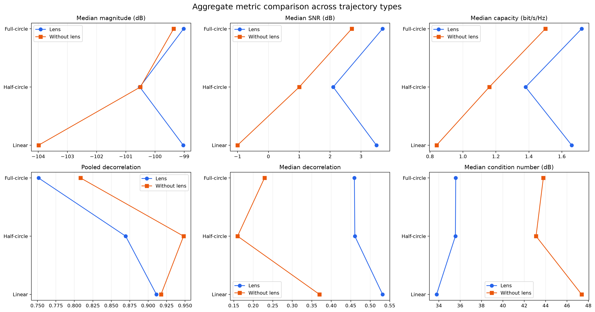
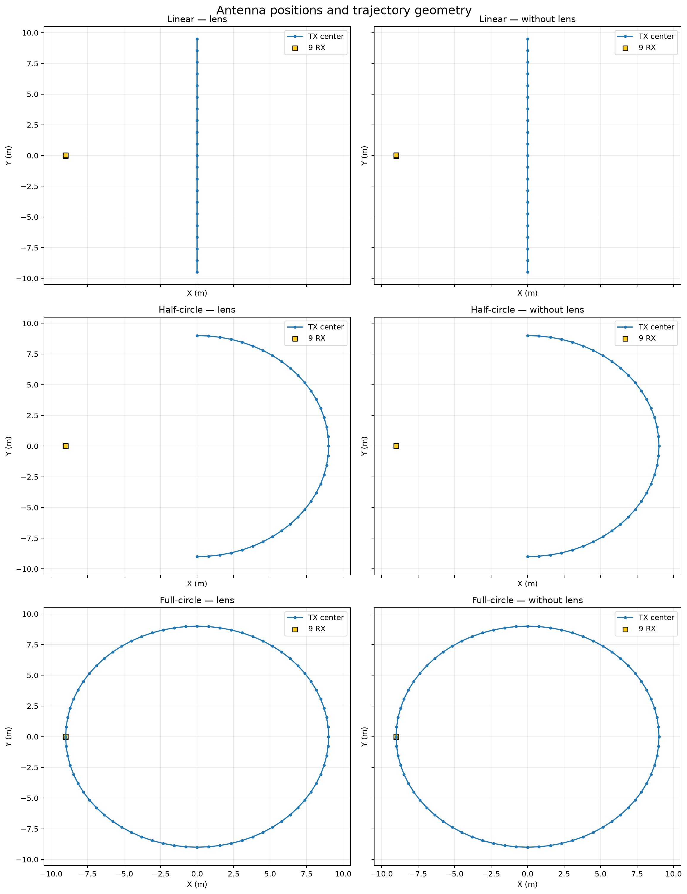
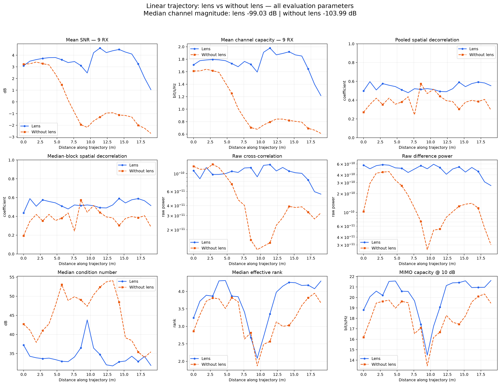
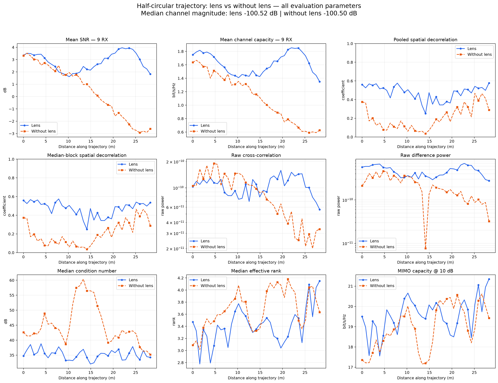
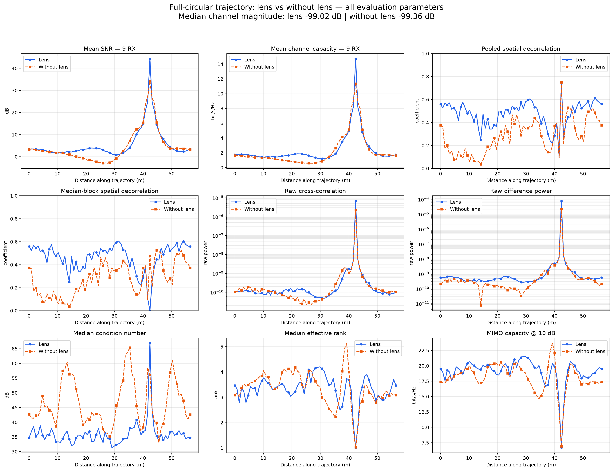

# Perbandingan Enam Skenario: Linear, Half-Circle, dan Full-Circle — Lens vs Without Lens

## Ringkasan teknis

Enam notebook dibandingkan dalam tiga pasangan trajectory identik. Lens meningkatkan median SNR dan kapasitas pada ketiga trajectory. Peningkatan paling jelas terjadi pada linear trajectory: SNR **-1,0 → 3,5 dB** dan kapasitas **0,84 → 1,66 bit/s/Hz**. Median decorrelation juga lebih tinggi dengan lens pada linear, half-circle, dan full-circle. Namun pooled decorrelation tanpa lens sedikit lebih tinggi pada ketiganya, sehingga pooled dan median harus dilaporkan bersama. Full-circle memiliki near-collision TX–RX dan belum layak digunakan untuk klaim performa fisik final.

## Temuan utama lintas trajectory

| scenario | label | trajectory | waypoints | length_m | magnitude_median_db | snr_median_db | capacity_median_bits_s_hz | pooled_correlation | pooled_decorrelation | median_correlation | median_decorrelation | raw_cross_correlation | raw_difference_power | condition_number_median_db | effective_rank_median | mimo_capacity_10db_median | min_tx_rx_distance_m | collision_risk |
| --- | --- | --- | --- | --- | --- | --- | --- | --- | --- | --- | --- | --- | --- | --- | --- | --- | --- | --- |
| linear_lens | Linear — lens | linear | 21 | 19 | -99.03 | 3.5 | 1.66 | 0.0889 | 0.9111 | 0.4684 | 0.5316 | 2.191e-11 | 4.943e-10 | 33.79 | 3.889 | 20.6 | 9.009 | False |
| linear_wolens | Linear — without lens | linear | 21 | 19 | -104 | -1 | 0.84 | 0.0826 | 0.9174 | 0.6303 | 0.3697 | 7.345e-12 | 1.718e-10 | 47.37 | 3.33 | 18.28 | 9 | False |
| half_lens | Half-circle — lens | half | 37 | 28.27 | -100.5 | 2.1 | 1.38 | 0.1305 | 0.8695 | 0.5395 | 0.4605 | 3.096e-11 | 4.67e-10 | 35.55 | 3.426 | 19.64 | 12.72 | False |
| half_wolens | Half-circle — without lens | half | 37 | 28.27 | -100.5 | 1 | 1.16 | 0.0521 | 0.9479 | 0.8402 | 0.1598 | 5.767e-12 | 2.202e-10 | 43.1 | 3.648 | 18.9 | 12.71 | False |
| full_lens | Full-circle — lens | full | 73 | 56.53 | -99.02 | 3.7 | 1.72 | 0.2485 | 0.7515 | 0.5407 | 0.4593 | 9.322e-08 | 1.069e-06 | 35.59 | 3.382 | 19.48 | 0.017 | True |
| full_wolens | Full-circle — without lens | full | 73 | 56.53 | -99.36 | 2.7 | 1.5 | 0.1916 | 0.8084 | 0.7711 | 0.2289 | 3.182e-08 | 3.081e-07 | 43.79 | 3.413 | 18.3 | 1.102e-15 | True |

## Persamaan dan definisi metrik

Untuk CFR kompleks $h_i[n]$ pada RX ke-$i$:

$$
ho_{ij}=rac{sum_nh_i[n]h_j^*[n]}{sqrt{(sum_n|h_i[n]|^2)(sum_n|h_j[n]|^2)}},qquad D_{ij}=1-|
ho_{ij}|.$$

Pooled correlation menggabungkan waypoint, mobility-time, dan frequency. Metode robust:

$$C_{ij}^{mathrm{med}}=operatorname{median}_{w,t}|
ho_{ij}^{(w,t)}|,qquad D_{ij}^{mathrm{med}}=1-C_{ij}^{mathrm{med}}.$$

Evaluasi tanpa normalisasi energi:

$$G_{ij}^{mathrm{raw}}=left|rac1Nsum_nh_i[n]h_j^*[n]
ight|,qquad Q_{ij}^{mathrm{raw}}=rac1Nsum_n|h_i[n]-h_j[n]|^2.$$

Kapasitas SISO memakai $C=log_2(1+gamma)$. Kapasitas MIMO memakai $log_2det(I+rac{gamma}{N_t}HH^H)$ dan effective rank dihitung dari entropi singular value ternormalisasi.

## Posisi antena

| scenario | TX coordinate CSV | RX coordinate CSV | RX centroid x_m | RX centroid y_m | RX centroid z_m | minimum TX-RX distance_m |
| --- | --- | --- | --- | --- | --- | --- |
| linear_lens | data/tx_linear_lens.csv | data/rx_linear_lens.csv | -9.013 | -1.927e-19 | 2 | 9.009 |
| linear_wolens | data/tx_linear_wolens.csv | data/rx_linear_wolens.csv | -9 | 0 | 2 | 9 |
| half_lens | data/tx_half_lens.csv | data/rx_half_lens.csv | -9.013 | -1.927e-19 | 2 | 12.72 |
| half_wolens | data/tx_half_wolens.csv | data/rx_half_wolens.csv | -9 | 0 | 2 | 12.71 |
| full_lens | data/tx_full_lens.csv | data/rx_full_lens.csv | -9.013 | -1.927e-19 | 2 | 0.017 |
| full_wolens | data/tx_full_wolens.csv | data/rx_full_wolens.csv | -9 | 0 | 2 | 1.102e-15 |

Linear TX center bergerak pada $x=0$, $y=-9.5$ sampai $9.5$, $z=2$ m. Half-circle memiliki radius 9 m pada sisi kanan ruang. Full-circle beradius 9 m dengan pusat $(0,0,2)$ dan melewati lokasi RX sekitar $(-9,0,2)$.

## Linear: gain link-quality lens paling kuat

Lens meningkatkan median magnitude sebesar 4,96 dB, median SNR 4,5 dB, kapasitas 0,82 bit/s/Hz, menurunkan condition number, dan meningkatkan MIMO capacity. Pooled decorrelation hampir sama (0,9111 vs 0,9174), sedangkan median decorrelation lebih baik dengan lens (0,5316 vs 0,3697).

## Half-circle: lens meningkatkan median decorrelation dan conditioning

Median magnitude hampir sama, tetapi lens memberi median SNR 2,1 dB dibanding 1,0 dB dan kapasitas 1,38 dibanding 1,16 bit/s/Hz. Median decorrelation lens 0,4605 versus 0,1598 tanpa lens. Tidak ada near-collision; minimum separation sekitar 12,7 m.

## Full-circle: hasil terkontaminasi near-collision

Lens memberi median SNR +1,0 dB dan kapasitas +0,22 bit/s/Hz. Lonjakan raw metrics dan SNR sekitar jarak 42 m berasal dari TX yang melewati RX. Minimum separation sekitar 0,017 m untuk lens dan praktis nol tanpa lens.

## Batasan, ketidakpastian, dan pemeriksaan robustness

- **Overall assessment: share with caveats.** Linear dan half-circle dapat dibandingkan secara langsung; full-circle perlu direvisi sebelum klaim final.
- Nilai decorrelation 0,5 bukan berarti 50% sinyal hilang; ia menyatakan tingkat ketidakmiripan pola channel kompleks.
- Raw metrics dihitung tanpa normalisasi; skala log hanya digunakan pada grafik.
- Tensor CFR kompleks $h(t,f)$ tidak disimpan oleh output notebook. Folder ini menyimpan raw cross-correlation dan raw difference power sebagai metrik turunan.
- Hasil bersifat deskriptif untuk scene, pola antena, frekuensi, sampling mobility, dan parameter ray tracing yang digunakan.

## Rekomendasi

1. Gunakan linear dan half-circle untuk perbandingan lens yang paling defensible.
2. Rerun full-circle dengan radius 7,5–8 m atau geser pusat untuk menjamin minimum TX–RX separation.
3. Simpan CFR kompleks per waypoint jika raw signal penuh diperlukan.
4. Laporkan pooled correlation, median correlation, raw power, condition number, effective rank, dan MIMO capacity secara bersama.

## Pertanyaan lanjutan

- Apakah decorrelation distance perlu dihitung menggunakan threshold tertentu, misalnya $|
ho|=0.5$?
- Apakah perbandingan antartrajectory perlu memakai normalized path progress atau posisi fisik yang sama?
