# Visual Analysis of the 9×9 Monte Carlo Simulation (RandomCom): Lens vs No Lens

This document discusses and concludes the Monte Carlo simulation carried out in two notebooks:

- [`Setup_20mx20m_wolens_9x9_Patch_randomCom.ipynb`](Setup_20mx20m_wolens_9x9_Patch_randomCom.ipynb) — **without-lens** RX scenario.
- [`Setup_20mx20m_lens_9x9_Patch_randomCom.ipynb`](Setup_20mx20m_lens_9x9_Patch_randomCom.ipynb) — **with-lens** RX scenario.

It is a companion to [`MONTE_CARLO_9x9_SIMULATION_DISCUSSION_AND_CONCLUSIONS.md`](MONTE_CARLO_9x9_SIMULATION_DISCUSSION_AND_CONCLUSIONS.md), which already discussed the same two notebooks narratively. Every figure quoted below has been re-verified here by parsing the raw notebook output into numeric tables, so this version additionally ships **comparison charts**, **structured analysis data**, and the **exact equations** used to compute each metric — all stored under [`asset/`](asset/) (see [Contents of the asset folder](#contents-of-the-asset-folder) at the end). The document is ordered bottom-up: section 0 characterizes each scenario **on its own** (its own capacity distribution, per-angle trend, delay spread, and virtual MIMO conditioning, with no reference to the other notebook), and only from section 1 onward are the two scenarios combined into the joint/paired comparison. Every chart — standalone (section 0) or comparison (sections 1–5) — is generated by **two independent toolchains**, Python/matplotlib ([`make_figures.py`](asset/scripts/make_figures.py)) and MATLAB ([`make_figures.m`](asset/scripts/make_figures.m)), both reading the same CSV under `asset/data/`; the Python render is embedded inline and the MATLAB render is collapsed right under it under "MATLAB render (cross-check)", so the two can be visually compared.

> No number here was recomputed from scratch — the notebooks were not re-executed. Values come from the Monte Carlo cell output already stored in both notebooks (per-drop log in cell 45, per-angle summary in cell 48, per-drop MIMO summary in cell 50), parsed into structured CSV so they can be plotted and cross-checked. The parsed results match the earlier discussion document exactly (median diff +0.40 bit/s/Hz, mean diff +0.15 bit/s/Hz, lens wins 106/180 pairs) — see [`asset/data/paired_diff_per_drop_rx.csv`](asset/data/paired_diff_per_drop_rx.csv).

## Scenario summary

| | Without lens | With lens |
|---|---|---|
| RX pattern | `FarFieldData_Patch_38GHz.csv` (identical for every angle label) | HFSS far-field pattern per lens angle |
| RX angles tested | +60°, +45°, +30°, +15°, 0°, −15°, −30°, −45°, −60° (labels only, identical pattern) | +60°, +45°, +30°, +15°, 0°, −15°, −30°, −45°, −60° (different pattern per angle) |
| Monte Carlo drops | 20 | 20 |
| TX per drop | 9 (random position, TX pattern forced to isotropic) | 9 (same positions as the no-lens scenario, per drop) |
| Total result rows | 180 (20 × 9) | 180 (20 × 9) |
| Room | 20 m × 20 m × 3 m, 38 GHz, 400 MHz BW, 401 frequency points | same |
| Path samples / source | 100,000 (recommended final value: 1,000,000) | same |

Because the TX positions in every drop are **identical** between the two notebooks (a paired design), the comparison in this document is fair: the performance difference comes purely from the RX pattern (with vs without lens), not from differing TX geometry.

## Equations used

These are the exact equations implemented in the notebooks' `random_channel_metrics`, `mimo_metrics_9x9`, and `mimo_capacity_9x9` functions, which produce every number and figure discussed below.

**1. Non-coherent combined RX power.** The nine TX are independent sources, so their received power (not their complex amplitude) is summed at each frequency bin $f$:

$$
P_\mathrm{RX}(f) = P_\mathrm{TX}\sum_{i=1}^{9}\left|H_i(f)\right|^2
$$

where $H_i(f)$ is the channel frequency response from TX $i$ to the RX, and $P_\mathrm{TX}$ is the per-TX transmit power (10 dBm).

**2. Noise power and SNR.** Thermal noise power uses $kTB$ scaled by the noise figure:

$$
P_\mathrm{N} = kTB\cdot 10^{\mathrm{NF}/10}, \qquad
\mathrm{SNR}(f) = \frac{P_\mathrm{RX}(f)}{P_\mathrm{N}}
$$

with Boltzmann constant $k = 1.380649\times10^{-23}\ \mathrm{J/K}$, temperature $T = 290\ \mathrm{K}$, bandwidth $B = 400\ \mathrm{MHz}$, and noise figure $\mathrm{NF} = 7\ \mathrm{dB}$.

**3. Equivalent SISO spectral efficiency (capacity).** The Shannon bound is averaged over the 401 frequency points:

$$
C = \mathbb{E}_f\!\left[\log_2\!\left(1+\mathrm{SNR}(f)\right)\right]
  = \frac{1}{N_f}\sum_{f} \log_2\!\left(1+\mathrm{SNR}(f)\right)
$$

**4. Ideal throughput.** A direct scaling of capacity by bandwidth — not a realizable protocol throughput:

$$
\mathrm{Throughput} = B \times C
$$

**5. Power-delay profile (PDP) and RMS delay spread.** The wideband response of each TX is inverse-Fourier-transformed to the delay domain and the nine per-TX power-delay profiles are summed (independent sources → power addition, same as step 1):

$$
h_i(\tau) = \mathrm{IFFT}_f\{H_i(f)\}, \qquad
\mathrm{PDP}(\tau) = \sum_{i=1}^{9}\left|h_i(\tau)\right|^2
$$

$$
\bar\tau = \frac{\sum_\tau \tau\cdot\mathrm{PDP}(\tau)}{\sum_\tau \mathrm{PDP}(\tau)}, \qquad
\tau_\mathrm{rms} = \sqrt{\frac{\sum_\tau (\tau-\bar\tau)^2\cdot\mathrm{PDP}(\tau)}{\sum_\tau \mathrm{PDP}(\tau)}}
$$

**6. Virtual 9×9 MIMO conditioning (per frequency bin).** The nine RX-angle channels are stacked into one $9\times9$ matrix $\mathbf{H}(f)$ and decomposed by SVD, $\mathbf{H}(f)=\mathbf{U}\boldsymbol\Sigma\mathbf{V}^{H}$, giving singular values $\sigma_1(f)\ge\dots\ge\sigma_9(f)$:

$$
\kappa(f) = \frac{\sigma_1(f)}{\sigma_9(f)}
\qquad\text{(condition number)}
$$

$$
p_i(f) = \frac{\sigma_i(f)^2}{\sum_{j}\sigma_j(f)^2}, \qquad
\mathrm{erank}(f) = \exp\!\left(-\sum_{i} p_i(f)\ln p_i(f)\right)
\qquad\text{(effective rank, Shannon entropy of the energy distribution)}
$$

**7. Virtual 9×9 MIMO ergodic capacity at a fixed SNR.** Equal power per stream over the full eigenmode set, with $\mathbf{H}$ normalized so $\mathbb{E}\!\left[|h|^2\right]=1$:

$$
C_\mathrm{MIMO}(\mathrm{SNR}) = \mathbb{E}_f\!\left[\sum_{i=1}^{9}\log_2\!\left(1+\frac{\mathrm{SNR}}{N_t}\,\sigma_i(f)^2\right)\right], \qquad N_t = 9
$$

reported at $\mathrm{SNR}=10\ \mathrm{dB}$. As with all metrics in step 6–7, the nine RX-angle channels are **not measured simultaneously by one physical receiver** — this is a virtual-diversity indicator, not a directly realizable MIMO capacity.

## 0. Individual (standalone) results, before any comparison

Before combining the two scenarios into the joint comparison charts of section 1–5, each notebook's own 180 rows (20 drops × 9 angles) are characterized **on its own**: capacity distribution, capacity per angle, RMS delay spread per angle, and the three virtual 9×9 MIMO metrics (condition number, effective rank, capacity @ 10 dB), computed only from that one notebook's data. This is the baseline each side contributes before section 1 onward puts them side by side.

### 0.1 Without-lens scenario (standalone)

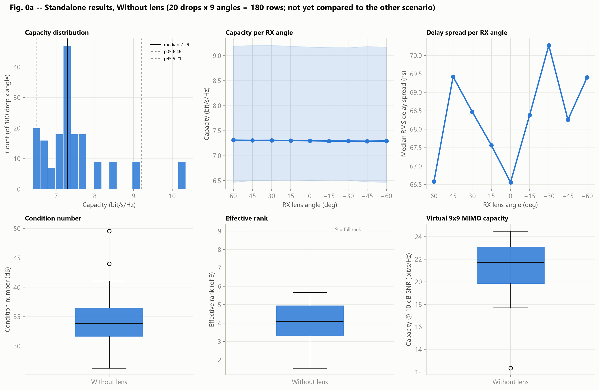
<details><summary>MATLAB render (cross-check)</summary>

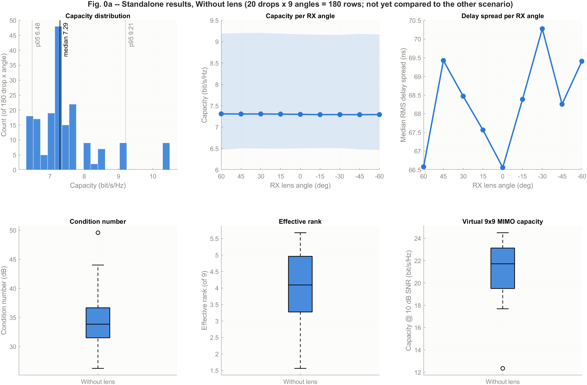
</details>

| Metric | Value |
|---|---:|
| Median capacity | 7.29 bit/s/Hz |
| 5th / 95th percentile capacity | 6.48 / 9.21 bit/s/Hz |
| Median RMS delay spread | 68.29 ns |
| Median condition number | 49.4 (33.8 dB) |
| Median effective rank | 4.09 of 9 |
| Median virtual MIMO capacity @ 10 dB | 21.72 bit/s/Hz |

On its own, the without-lens scenario is close to a flat baseline: capacity per angle sits at ≈7.3 bit/s/Hz for every one of the nine angle labels (top-middle panel), which is expected since every label reuses the same patch RX pattern — the "angle" here only shifts the RX by a few centimeters, not the antenna response. Delay spread per angle (top-right) is noisier, wandering between ≈66.6 ns and ≈70.3 ns with no obvious trend against angle. The bottom row shows the virtual 9×9 MIMO conditioning computed only from this scenario's 20 drops: effective rank sits around 4 of 9 (well short of full rank), and condition number has a couple of high-leverage outlier drops (up to ≈50).

### 0.2 With-lens scenario (standalone)

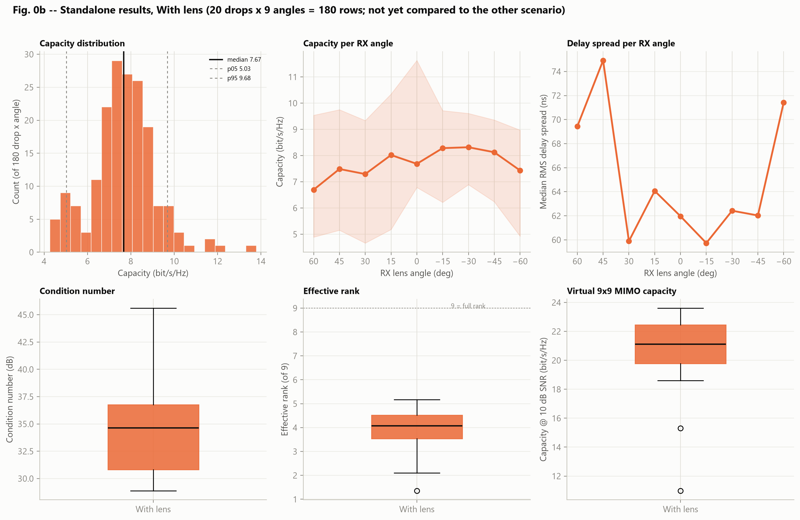
<details><summary>MATLAB render (cross-check)</summary>

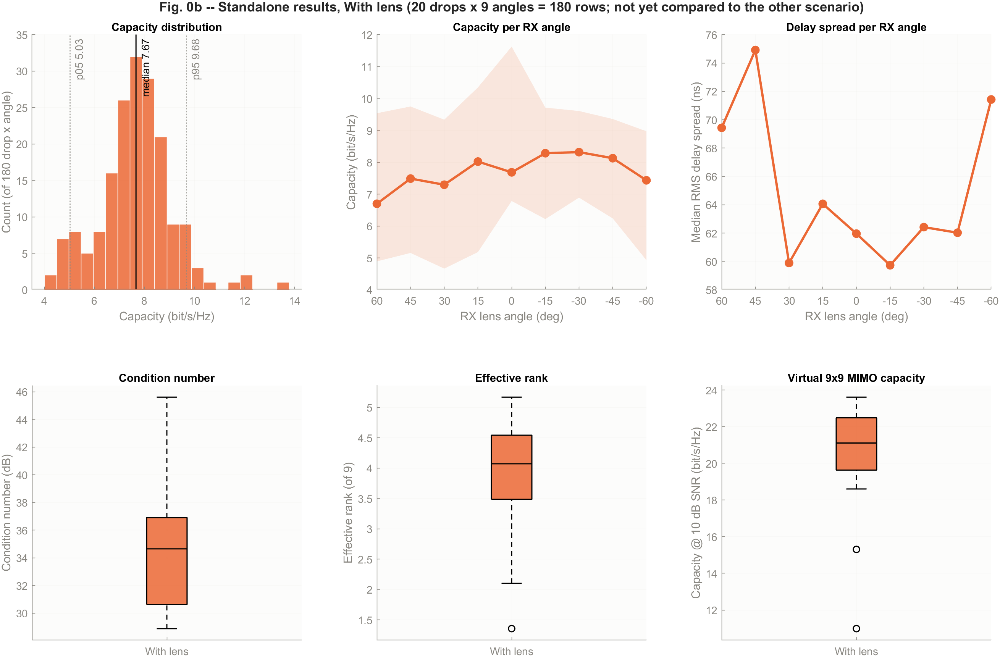
</details>

| Metric | Value |
|---|---:|
| Median capacity | 7.67 bit/s/Hz |
| 5th / 95th percentile capacity | 5.02 / 9.68 bit/s/Hz |
| Median RMS delay spread | 65.01 ns |
| Median condition number | 54.0 (34.6 dB) |
| Median effective rank | 4.07 of 9 |
| Median virtual MIMO capacity @ 10 dB | 21.11 bit/s/Hz |

Taken on its own, the with-lens scenario already shows the angle-dependence that later drives the comparison: capacity per angle (top-middle panel) is visibly not flat, dipping to its lowest around +60° and cresting around −15°/−30°, with a percentile band that widens noticeably beyond ±30°. The capacity histogram (top-left) is also wider and less peaked than the without-lens histogram in section 0.1, on the same x-axis scale — spread that's intrinsic to this scenario alone, before any pairing against the other notebook. Delay spread per angle (top-right) swings more sharply than the without-lens case, and the virtual MIMO panels (bottom row) look similar in shape to section 0.1's — effective rank still around 4 of 9 — which already hints that the lens does not change MIMO conditioning much, a point developed further in section 5.

With both scenarios now characterized independently, the rest of this document (sections 1–5) puts them side by side under the same paired-drop geometry.

## 1. Aggregate capacity: without lens vs with lens

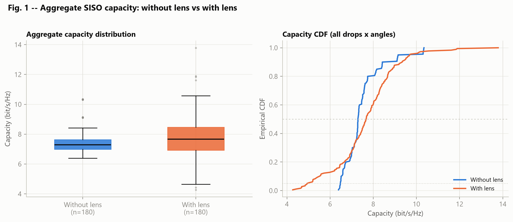
<details><summary>MATLAB render (cross-check)</summary>

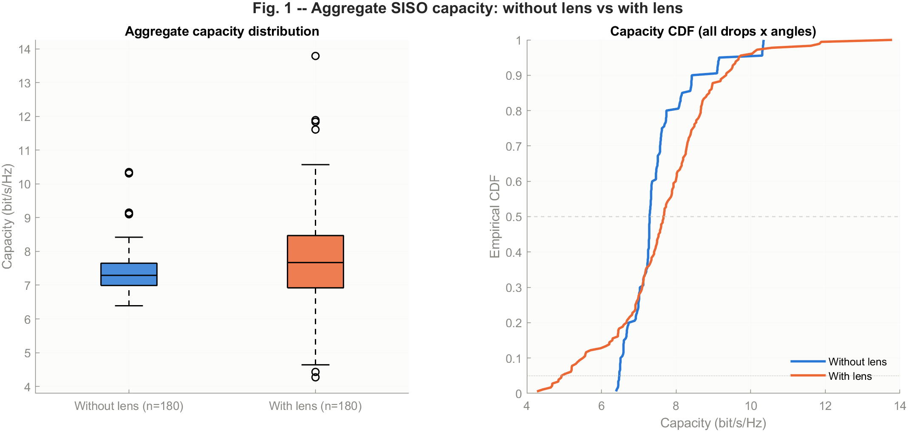
</details>

| Metric | Without lens | With lens | Change |
|---|---:|---:|---:|
| Median capacity | 7.29 bit/s/Hz | 7.67 bit/s/Hz | +0.38 (+5.2%) |
| 5th percentile | 6.48 bit/s/Hz | 5.02 bit/s/Hz | −1.46 |
| 95th percentile | 9.21 bit/s/Hz | 9.68 bit/s/Hz | +0.47 |
| Median ideal throughput | 2.92 Gbit/s | 3.07 Gbit/s | +0.15 (+5.1%) |

The left boxplot shows a slightly higher median with the lens, but a much wider box (IQR) and whiskers — the lens widens the spread of outcomes, not just shifts them upward. The CDF on the right makes this explicit: below capacity ≈7.3 bit/s/Hz the orange (lens) curve sits **left** of the blue curve (worse, heavier lower tail), while above ≈7.5 bit/s/Hz the orange curve shifts **right** (better). This crossover is consistent with the drop in the 5th percentile (−1.46 bit/s/Hz) despite the rise in median and 95th percentile.

## 2. Capacity per RX angle — the dominant factor with a lens

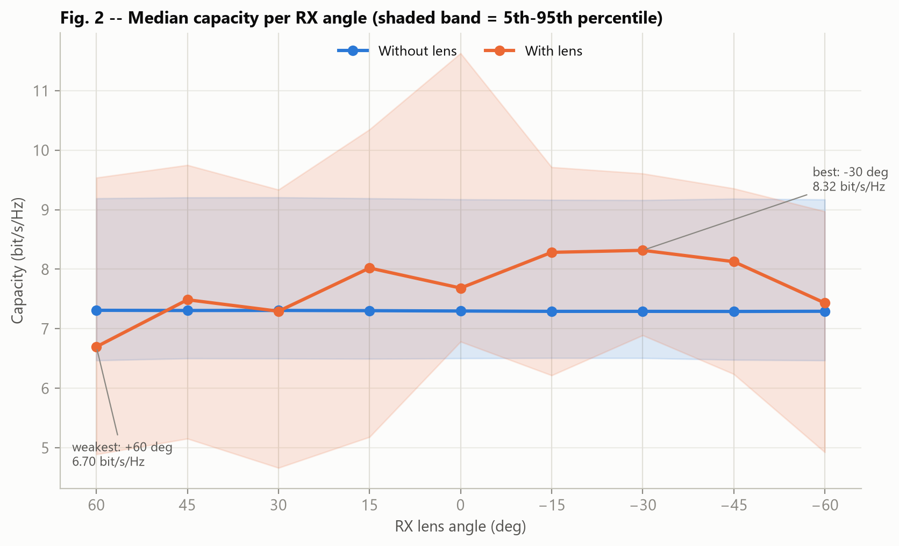
<details><summary>MATLAB render (cross-check)</summary>

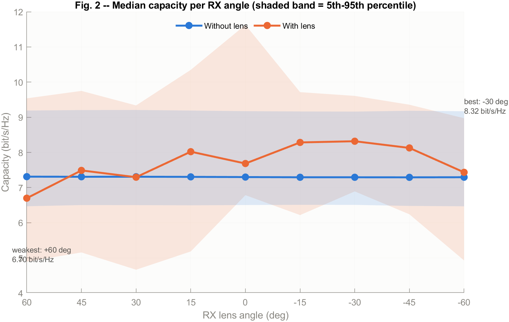
</details>

| Angle | Without lens (median) | With lens (median) | Difference |
|---:|---:|---:|---:|
| +60° | 7.31 | 6.70 | −0.61 |
| +45° | 7.31 | 7.49 | +0.18 |
| +30° | 7.31 | 7.29 | −0.01 |
| +15° | 7.30 | 8.02 | +0.72 |
| 0° | 7.30 | 7.68 | +0.39 |
| −15° | 7.29 | 8.28 | +0.99 |
| −30° | 7.29 | **8.32** | **+1.03** |
| −45° | 7.29 | 8.13 | +0.84 |
| −60° | 7.29 | 7.43 | +0.14 |

The blue line (without lens) is essentially flat around ≈7.3 bit/s/Hz across every angle label — expected, since every label uses the same patch RX pattern and the RX position only shifts a few centimeters between labels. The orange line (with lens) varies far more: **−30° is the best angle** (8.32 bit/s/Hz), while **+60° is the weakest** (6.70 bit/s/Hz) — even lower than the no-lens condition at the same nominal angle. The shaded 5th–95th percentile band on the lens side is also much wider and asymmetric relative to the no-lens side, confirming the lens behaves as a **direction-selective gain mechanism**: beneficial when the angle is favorable, detrimental when it is not.

The angular pattern is also **not symmetric** between the positive and negative sides (e.g. −30° = 8.32 vs +30° = 7.29; −45° = 8.13 vs +45° = 7.49), suggesting a difference in HFSS beam mapping, RX orientation, or parameter filtering across angles that should be verified before treating the asymmetry as a purely physical effect.

## 3. Paired check by drop

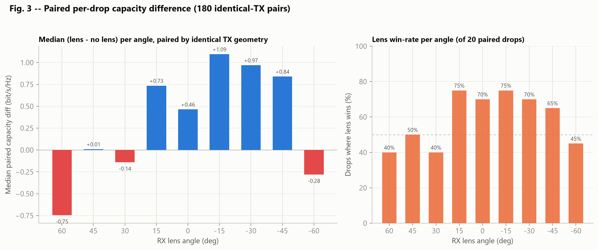
<details><summary>MATLAB render (cross-check)</summary>

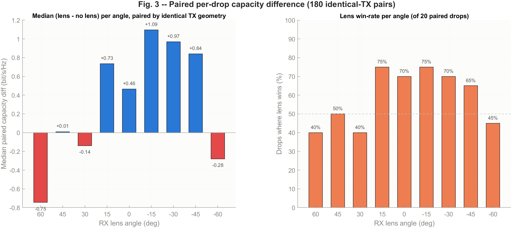
</details>

Because TX positions are identical between the two notebooks in every drop, 180 result pairs can be compared directly (`asset/data/paired_diff_per_drop_rx.csv`):

- median capacity difference (lens − no lens): **+0.40 bit/s/Hz**
- mean capacity difference: **+0.15 bit/s/Hz**
- the lens wins in **106 of 180 pairs (58.9%)**

The left panel shows the median difference per angle: positive (blue) from +15° through −45°, peaking at −15° (+1.09) and −30° (+0.97); negative (red) at +60°, +30°, and −60°. The right panel (lens win-rate per angle across 20 drops) confirms the same pattern: the lens wins 75% of drops at +15°/−15°, but only 40% at +60°/+30°. No single angle gives the lens a universal (100%) advantage — the benefit depends on how well the TX–RX geometry aligns with the lens beam in each drop, not on a fixed angular superiority.

## 4. RMS delay spread

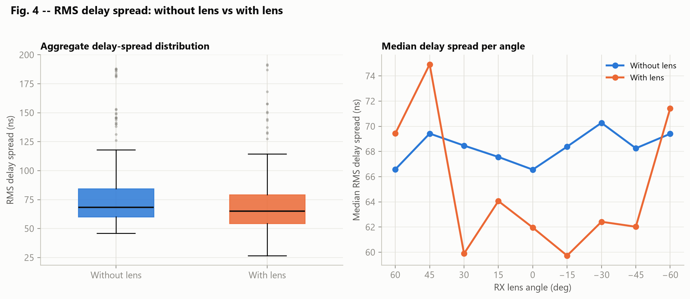
<details><summary>MATLAB render (cross-check)</summary>

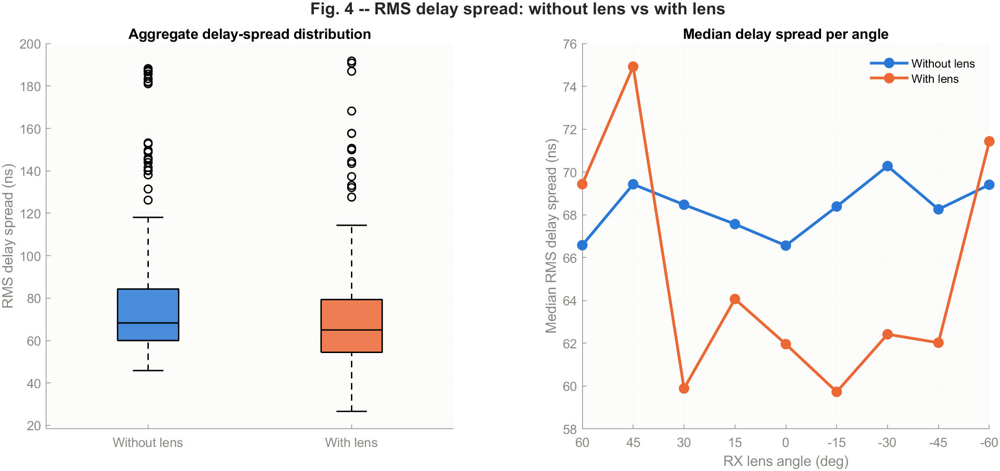
</details>

| Metric | Without lens | With lens |
|---|---:|---:|
| Median RMS delay spread | 68.29 ns | 65.01 ns |
| Median paired difference | — | −4.70 ns |

Median RMS delay spread decreases slightly with the lens (−4.8%), but the right panel shows a non-uniform per-angle pattern: delay spread with the lens is actually higher at +45° and −60°, and lower at other angles (especially +30° and −15°). This is consistent with the lens reshaping the power-delay profile in a direction-dependent way, rather than uniformly compressing it at every angle.

## 5. Virtual 9×9 MIMO channel conditioning

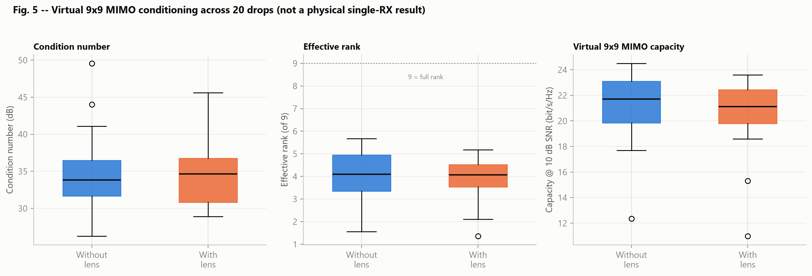
<details><summary>MATLAB render (cross-check)</summary>

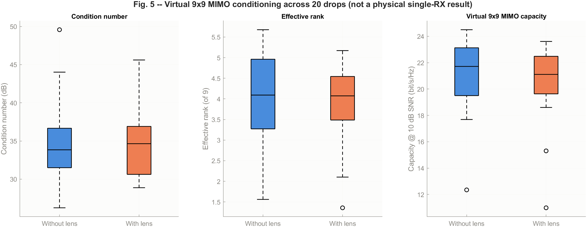
</details>

| Metric | Without lens | With lens |
|---|---:|---:|
| Median condition number | 49.4 (33.8 dB) | 54.0 (34.6 dB) |
| Median effective rank | 4.09 of 9 | 4.07 of 9 |
| Median capacity @ 10 dB | 21.72 bit/s/Hz | 21.11 bit/s/Hz |

Recall (equations 6–7 above): the nine RX channels in this "9×9 MIMO" matrix are **not measured simultaneously** by one physical receiver — nine lens angles are simulated sequentially and combined into a virtual matrix purely to assess channel diversity/conditioning, not to claim a physically realizable MIMO capacity. All three panels in Fig. 5 show the lens does **not improve** this conditioning: the median condition number rises slightly (worse), the median effective rank barely changes (~4 of 9, far from full rank), and the median capacity @10 dB actually drops by ≈0.61 bit/s/Hz. The IQR of capacity @10 dB also looks marginally wider with the lens. This does not contradict the rise in aggregate SISO capacity in section 1 — a lens can raise power/SNR at specific angles without improving inter-channel orthogonality.

## Limitations (inherited from both notebooks)

1. The number of drops is still small (20) — enough for an initial indication, not enough to stably estimate distribution tails or outage.
2. Path sampling (100,000/source) is not yet at the notebooks' recommended final value (1,000,000/source).
3. The Monte Carlo TX pattern is isotropic — results do not measure TX patch-pattern effects.
4. Total power grows with the number of TX (9 × 10 dBm); for a fixed-total-power comparison, per-TX power should be reduced by ≈9.54 dB.
5. Capacity is an ideal Shannon bound, without discrete modulation/coding/overhead/interference/real channel estimation.
6. No-lens angle labels are not physically different angular patterns — they exist only as pairing identifiers against the lens configurations.
7. Lens angle asymmetry (+/−) has not been verified against boresight direction, RX orientation, or HFSS file mapping.
8. The 9×9 MIMO model is virtual, not a physically realizable single-RX capacity.

## Conclusion

Based on the charts and data under `asset/`, the RX lens delivers a **moderate improvement in typical performance** (median capacity +5.2%, ideal throughput +5.1%) and a small reduction in median RMS delay spread. However, this benefit is **strongly angle-dependent**: best from −15° to −45° (peaking at −30°), while +60° is actually worse than no lens. The 5th-percentile capacity also degrades (−1.46 bit/s/Hz), and the paired check shows the lens wins only 58.9% of the 180 drop–angle pairs — not a universal advantage. The virtual 9×9 MIMO metrics likewise show no improvement in channel conditioning.

This main conclusion is consistent with [`MONTE_CARLO_9x9_SIMULATION_DISCUSSION_AND_CONCLUSIONS.md`](MONTE_CARLO_9x9_SIMULATION_DISCUSSION_AND_CONCLUSIONS.md): the lens has the potential to increase system capacity, but success depends on **angle selection, orientation, and far-field-pattern mapping**, and this result remains a **preliminary indication** (20 drops, 100,000 samples/source) rather than a final design result. Follow-up recommendations (≥100–500 drops, 1,000,000 samples/source, fixed total power budget, verification of the HFSS angle mapping) follow the list in the earlier discussion document.

## Contents of the asset folder

```
asset/
├── figures/                        # comparison figures (PNG, embedded above)
│   ├── fig0a_without_lens_individual.png         # standalone (single-scenario) results, without lens
│   ├── fig0a_without_lens_individual_matlab.png  # MATLAB render of the same chart
│   ├── fig0b_with_lens_individual.png            # standalone (single-scenario) results, with lens
│   ├── fig0b_with_lens_individual_matlab.png      # MATLAB render of the same chart
│   ├── fig1_capacity_aggregate.png         # Python/matplotlib render
│   ├── fig1_capacity_aggregate_matlab.png  # MATLAB render of the same chart
│   ├── fig2_capacity_vs_angle.png
│   ├── fig2_capacity_vs_angle_matlab.png
│   ├── fig3_paired_diff_by_angle.png
│   ├── fig3_paired_diff_by_angle_matlab.png
│   ├── fig4_delay_spread.png
│   ├── fig4_delay_spread_matlab.png
│   ├── fig5_mimo_conditioning.png
│   └── fig5_mimo_conditioning_matlab.png
├── data/                           # structured analysis data (CSV)
│   ├── wolens_per_drop_rx.csv      # 180 rows: drop x angle, without lens
│   ├── lens_per_drop_rx.csv        # 180 rows: drop x angle, with lens
│   ├── combined_per_drop_rx.csv    # both of the above combined + a "config" column
│   ├── paired_diff_per_drop_rx.csv # 180 pairs + difference (lens - wolens)
│   ├── wolens_per_rx_summary.csv   # median/p05/p95/SNR summary per angle, without lens
│   ├── lens_per_rx_summary.csv     # same, with lens
│   ├── wolens_mimo_per_drop.csv    # 20 rows: condition number/effective rank/capacity@10dB per drop
│   ├── lens_mimo_per_drop.csv      # same, with lens
│   └── raw_logs/                   # raw log text from cells 45/48/50 of both notebooks (parsing source)
└── scripts/
    ├── parse.py                    # raw_logs/*.txt -> data/*.csv  (Python)
    ├── make_figures.py             # data/*.csv -> figures/*.png   (Python/matplotlib)
    └── make_figures.m              # data/*.csv -> figures/*_matlab.png  (MATLAB)
```

All CSV files and figures can be regenerated by running `parse.py` then `make_figures.py` (Python env `sionna_env`) without re-running either simulation notebook. `make_figures.m` is an independent MATLAB port of `make_figures.py`: it reads the same `asset/data/*.csv` files, opens the same five charts as normal interactive figure windows (it does not just silently write files to disk), and additionally exports each one as `asset/figures/figN..._matlab.png` so the MATLAB render can be checked side by side against the Python one. Run it from MATLAB with `run('asset/scripts/make_figures.m')` — paths are resolved relative to the script's own location, so it works regardless of the current folder.
